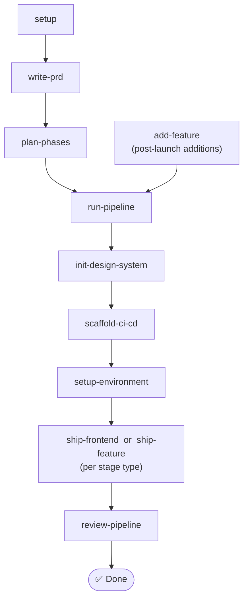

# Stagecoach

> A Claude Code plugin that takes a project from a free-form brief to a shipping production web app through a phased, multi-agent workflow.

Stagecoach scaffolds a cohesive design system, CI/CD with visual + design-system regression gates, an environment-setup gate, an optional database schema foundation, and 20–30 vertical-slice feature stages — pausing for human approval only at the four checkpoint categories where judgment actually matters.

---

## Install

```text
/add-plugin stagecoach
```

Or clone manually: `git clone https://github.com/steve-piece/stagecoach.git` and add it as a plugin via your project rules file.

---

## Workflow

The pipeline, step by step:

- **setup** — Bootstraps a new project (or drops config into an existing one) and checks the CI/CD baseline.
- **write-prd** — Turns a free-form project brief into a structured PRD.
- **plan-phases** — Decomposes the PRD into a master checklist, three foundation stages (plus an optional db-schema stage if the PRD has a backend), and 20–30 feature stages.
- **add-feature** — Skip ahead. Adds new stages directly to a project that already shipped.
- **run-pipeline** — Drives the entire plan stage-by-stage, dispatching the right skill per stage.
- **init-design-system** — Validates or generates the design system; no UI ships until tokens lock.
- **scaffold-ci-cd** — Wires CI/CD, Playwright, design-system-compliance, and visual-regression baselines.
- **setup-environment** — Walks through external service setup and verifies `.env.local` is fully populated.
- **ship-frontend** — Delivers frontend stages through a 6-agent design pipeline ending in a visual review gate.
- **ship-feature** — Delivers backend, full-stack, and DB stages with an implementer plus spec, quality, and CI/CD reviewers.
- **review-pipeline** *(experimental)* — After the plan ships, surfaces friction patterns and drafts improvements back to the plugin.



Two ways in: build a fresh project end-to-end starting from `setup`, or add features to an already-shipped project starting from `add-feature`. Either way, the same delivery + CI gates run. Stage 4 (db-schema-foundation, conditional) routes to `ship-feature` with a DB flag — bundled into the `ship-frontend or ship-feature` node above for visual simplicity.

**Foundation stages** (run before any feature stage; Stage 4 only when the PRD has a backend):

| # | Stage | Skill |
|---|---|---|
| 1 | Design system gate | `init-design-system` |
| 2 | CI/CD scaffold | `scaffold-ci-cd` |
| 3 | Environment setup gate | `setup-environment` |
| 4 | DB schema foundation (conditional) | `ship-feature` (DB context) |
| 5..N | Feature stages (vertical slices, 20–30 typical) | `ship-frontend` or `ship-feature` |

Hard caps per stage: **6 tasks**, ~10–15 files changed, completable in one fresh agent session. Override `stages.maxTasksPerStage` in `stagecoach.config.json`.

---

## Skills

| Skill | Slash command | Description |
|---|---|---|
| `setup` | `/stagecoach:setup` | Bootstraps a new project or drops Stagecoach config into an existing one. Auto-detects which flow you're in and checks for the CI/CD baseline. |
| `write-prd` | `/stagecoach:write-prd` | Turns a free-form project brief into a structured 8-section PRD, asking clarifying questions when the brief is ambiguous. |
| `plan-phases` | `/stagecoach:plan-phases` | Decomposes a finalized PRD into a master checklist, foundation stages, and 20–30 vertical-slice feature stages. |
| `init-design-system` | `/stagecoach:init-design-system` | Validates or generates the project design system — globals.css, Tailwind config, and design-system rules — so all UI work starts from locked tokens. |
| `scaffold-ci-cd` | `/stagecoach:scaffold-ci-cd` | Wires up the CI/CD baseline: GitHub workflows, Playwright, design-system-compliance, visual regression, and (when applicable) DB schema drift checks. |
| `setup-environment` | `/stagecoach:setup-environment` | Walks the user through external service setup and verifies `.env.local` is fully populated before features can ship. |
| `ship-frontend` | `/stagecoach:ship-frontend` | Delivers a frontend stage through a 6-agent design pipeline and gates the PR on a passing visual review against the design system. |
| `ship-feature` | `/stagecoach:ship-feature` | Delivers a backend, full-stack, or DB stage with an implementer agent plus spec, quality, and CI/CD reviewers. |
| `add-feature` | `/stagecoach:add-feature` | Bolts new features onto a project that already shipped, assessing complexity and writing fresh stage files into the existing master checklist. |
| `run-pipeline` | `/stagecoach:run-pipeline` | Drives a full phased plan from start to finish, dispatching the right skill per stage and pausing for approval between stages by default. |
| `review-pipeline` | `/stagecoach:review-pipeline` | Experimental. After a plan completes, looks for friction patterns across recent stages and drafts improvements back to the plugin. |

Each skill's full reference, sub-agents, and completion checklist live in `skills/<name>/SKILL.md`.

---

## Personalize

Drop a `stagecoach.config.json` at your project root to override defaults:

```jsonc
{
  "modelTiers":   { "implementer": "opus", "qualityReviewer": "opus" },
  "stages":       { "maxTasksPerStage": 6, "targetFeatureStages": "20-30" },
  "mcps":         { "shadcn": true, "magic": false, "figma": false, "chromeDevTools": true },
  "visualReview": { "tools": ["claude-in-chrome", "chrome-devtools-mcp", "playwright"], "vizzly": false },
  "hitl":         { "additionalCategories": [] },
  "rules":        { "imports": [] }
}
```

Full schema + precedence rules at [`skills/setup/references/stagecoach-config-schema.md`](skills/setup/references/stagecoach-config-schema.md). System-wide defaults via `~/.stagecoach/defaults.json` (created during first-time install).

**Precedence (top wins):** env vars → `stagecoach.config.json` → project rules file (CLAUDE.md / AGENTS.md) → plugin defaults.

---

## Conventions worth knowing

- **HITL bubbling.** Sub-agents never prompt the user directly — they return `needs_human: true` with one of four categories: `prd_ambiguity`, `external_credentials`, `destructive_operation`, `creative_direction`. Only `run-pipeline` calls `ask_user_input_v0`.
- **Model tiers.** Three aliases (`haiku`, `sonnet`, `opus`); heavier tiers go to producing/verifying agents (`implementer` = `opus, xhigh`; `quality-reviewer` = `opus, high`). Full per-agent table at [`skills/setup/references/model-tier-guide.md`](skills/setup/references/model-tier-guide.md).
- **Visual review tooling priority** (hardcoded, no discovery): Claude in Chrome > Chrome DevTools MCP > Playwright > Vizzly. Full-page screenshots only at 375 / 768 / 1280 / 1920 viewports.
- **One slice per PR.** Default branch naming: `feat/stage-<n>-<scope>`.

---

## Repository

- GitHub: [steve-piece/stagecoach](https://github.com/steve-piece/stagecoach)
- Changelog: [CHANGELOG.md](CHANGELOG.md)

## License

MIT
