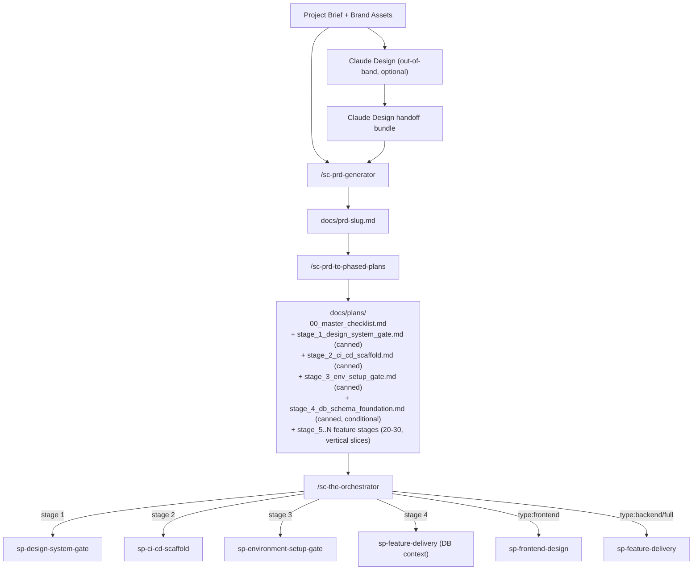

# Stagecoach

Stagecoach is a Claude Code plugin that takes a project from a free-form brief to a shipping production web app through a phased, multi-agent workflow.

## Introduction

Stagecoach is a Claude Code plugin that drives an AI agent — and the human in the loop — stage-by-stage through end-to-end web project delivery. From a free-form brief, Stagecoach generates a structured PRD, decomposes it into phased plans, and ships through canonical foundation stages (design system → CI/CD → environment setup → optional database schema) before delivering 20–30 vertical-slice feature stages with embedded visual, design-system-compliance, and database-schema-drift CI gates. Outputs are production-grade web apps — single-application or Turborepo monorepo — with cohesive token-driven design across surfaces, env-verified deploys, and schema-aware migrations. Stagecoach intentionally pauses only at four well-defined human-in-the-loop categories — PRD ambiguity, external credentials, destructive operations, and subjective creative direction — so the agent never blocks on questions it could reasonably answer itself.

## Installation

### Claude Code (Plugin Marketplace)

```text
/add-plugin phased-dev-workflow
```

Or search for "phased-dev-workflow" in the Claude Code plugin marketplace.

### Manual

Clone this repo into your project:

```bash
git clone https://github.com/steve-piece/phased-dev-workflow.git
```

Then add it as a plugin via your rules file (cursor or claude).

## Workflow



### The high-level loop

1. **`/sc-prd-generator`** turns a brief (and optional Claude Design handoff bundle) into `docs/prd-<slug>.md`.
2. **`/sc-prd-to-phased-plans`** decomposes the PRD into `docs/plans/00_master_checklist.md` plus four canned foundation stages and 20–30 vertical-slice feature stages. Linear is now optional — a question gate in this skill asks whether to include issue-tracking integration.
3. **`/sc-the-orchestrator`** drives the entire plan end-to-end. For each stage it dispatches a `stage-runner` subagent that loads the right skill, verifies the result via a `pr-reviewer` subagent, and advances only after a clean `main`.

## Stage Architecture

### Foundation stages (always run, in order)

| Stage | Name | Skill | Notes |
|-------|------|-------|-------|
| 1 | design-system-gate | `sp-design-system-gate` | Generates or validates the token-driven design system; blocks feature work until compliant |
| 2 | ci-cd-scaffold | `sp-ci-cd-scaffold` | Bootstraps Playwright suites, GitHub Actions, Husky pre-push, PR template, branch protection |
| 3 | env-setup-gate | `sp-environment-setup-gate` | External account setup + `.env.local` population; env-verified before feature stages begin |
| 4 | db-schema-foundation | `sp-feature-delivery` (DB context) | Conditional — only emitted when the PRD includes a database. Sets schema baseline + migration tooling |

### Feature stages (5..N — 20–30 typical)

Each feature stage is a vertical slice: UI + route + data + tests in a single PR. Every feature stage embeds its own completion checklist and CI gates. Stages are grouped as shell (route, layout, empty/loading/error states) + data (queries, mutations, polish) by default.

Hard caps per stage: **6 tasks**, ~10–15 files changed, completable in one fresh agent session.

## Skills

### sc-prd-generator

Generate a complete PRD from a free-form project brief. Accepts optional overrides to the default tech stack and conventions. Outputs a single markdown file with all sections including a phased implementation plan. A `prd-reviewer` subagent runs automatically to validate spec completeness before handoff.

**Bundled references:**
- `references/prd-template-v2.md` — canonical section structure
- `references/project-defaults.md` — default tech stack, services, conventions

**Dispatched subagents:**
- `prd-reviewer` — validates spec completeness and surfaces ambiguities before handoff

### sc-prd-to-phased-plans

Decompose a PRD into a master checklist and per-stage implementation files. Emits four canned foundation stage files and writes 20–30 vertical-slice feature stages in parallel via `phased-plan-writer` subagents. Linear integration is now optional — answered via a question gate. The `master-checklist-synthesizer` subagent aggregates `completion_criteria` from every stage file's frontmatter into `00_master_checklist.md`.

**Bundled references:**
- `references/templates.md` — master checklist, stage plan, and canned stage templates
- `references/architecture-conventions.md` — opinion-free baseline (web standards, security, framework facts)
- `references/stage-frontmatter-contract.md` — required YAML frontmatter shape for all stage files
- `references/canned-stages/` — canned stage files for stages 1–4

**Dispatched subagents:**
- `design-system-stage-writer` — writes stage 1 file
- `ci-cd-scaffold-stage-writer` — writes stage 2 file
- `env-setup-stage-writer` — writes stage 3 file
- `db-schema-stage-writer` — writes stage 4 file (conditional)
- `phased-plan-writer` — one invocation per feature stage (5..N), in parallel
- `master-checklist-synthesizer` — aggregates completion criteria across all stage files

### sc-design-system-gate (NEW)

Validate or generate a token-driven design system before any feature work begins. Ingests an optional Claude Design handoff bundle, expands brand primitives into a full token set, and runs a compliance pre-check against the project's component library. Blocks the orchestrator from advancing to Stage 2 until the design system is committed and validated.

**Dispatched subagents:**
- `bundle-validator` — validates the incoming Claude Design handoff bundle structure
- `token-expander` — expands brand primitives into full token set (opus, high effort)
- `compliance-pre-check` — verifies token coverage against component library

### sc-environment-setup-gate (NEW)

Guide the human through external account setup and `.env.local` population before feature stages begin. Runs a structured checklist of required services (Supabase, Stripe, Resend, etc.) per the PRD's service requirements. The `env-verifier` subagent mechanically scans `.env.local` against expected keys and returns pass/fail before the orchestrator advances.

**Bundled references:**
- `references/env-checklist-template.md`
- `references/known-services-catalog.md`

**Dispatched subagents:**
- `env-verifier` — mechanical `.env.local` scan; returns pass/fail verdict

### sc-ci-cd-scaffold (v2)

Bootstrap a production-grade CI/CD + E2E baseline on a dedicated `chore/ci-cd-scaffold` branch. Creates Playwright `@feature` / `@regression-core` suites, GitHub Actions `ci.yml` / `e2e.yml` / `e2e-coverage.yml`, Husky `pre-push`, a PR template, and the branch-protection setup script. Completion checklist is now embedded in the skill file. Ends with a green PR merged to `main`.

**Bundled references:**
- `references/scaffold-artifact-templates.md` — verbatim file templates for every artifact

### sc-frontend-design (NEW)

Deliver frontend-tagged feature stages with a multi-agent pipeline optimized for visual fidelity and design-system compliance. Orchestrates six specialized subagents: `modern-ux-expert` (pattern selection), `layout-architect` (shell structure), `block-composer` (section composition), `component-crafter` (token-only component authoring), `state-illustrator` (loading/error/empty coverage), and `visual-reviewer` (Claude in Chrome screenshot verification).

**Dispatched subagents:**
- `modern-ux-expert` — UX pattern selection
- `layout-architect` — shell-level layout decisions
- `block-composer` — section and block composition
- `component-crafter` — token-only component authoring
- `state-illustrator` — loading / error / empty state coverage
- `visual-reviewer` — visual verification via Claude in Chrome

### sc-feature-delivery (slimmed)

Orchestrate backend and full-stack feature stages using a parallel-subagent pipeline (discovery, checklist-curator, implementer, spec-reviewer, quality-reviewer, ci-cd-guardrails). Skill file is ~50% smaller in v2 — completion checklist is now embedded; `skill-mcp-scout` subagent removed. The `ci-cd-guardrails` subagent blocks PR creation if existing CI gates would weaken.

**Dispatched subagents:**
- `discovery` — codebase + GitNexus reconnaissance
- `checklist-curator` — slice scoping + checklist diff
- `implementer` — slice implementation (opus, high effort)
- `spec-reviewer` — spec compliance check
- `quality-reviewer` — code quality pass
- `ci-cd-guardrails` — CI/CD safety pass; blocks PR if existing gates would weaken

### sc-the-orchestrator (redefined)

Drive an entire phased plan end-to-end by dispatching one `stage-runner` subagent per stage in strict sequence. Reads the master checklist, dispatches the correct skill per stage type, verifies each PR via a `pr-reviewer` subagent, enforces the clean-`main` invariant between stages, and advances. The orchestrator is the **only** surface that prompts the human — all subagents bubble HITL triggers up rather than prompting directly.

See [Orchestrator Modes](#orchestrator-modes) below.

**Bundled references:**
- `references/per-stage-prompt-template.md` — exact prompt sent to each stage-runner

**Dispatched subagents:**
- `stage-runner` — opus, high effort; runs one stage end-to-end via the correct skill
- `pr-reviewer` — sonnet; readonly post-merge sanity check

### sc-phased-dev-retrospective (NEW, experimental)

Cross-stage friction detection after a full plan completes. Reads the master checklist, all stage files, and git history to surface patterns: repeated HITL triggers, recurring CI failures, scope drift, model-assignment mismatches. Drafts improvement PRs back to the plugin repository. Invoked manually after all stages are done — not called by the orchestrator.

**Dispatched subagents:**
- `retrospective-reviewer` — opus, high effort; cross-stage pattern detection

## Slash Commands

All Stagecoach slash commands are prefixed with `sc-` (for **s**tage**c**oach) so they're easy to recall and don't collide with other Claude Code plugins. Example: `/sc-prd-generator`, `/sc-the-orchestrator`.

| Command | Skill loaded | When to use |
|---------|-------------|-------------|
| `/sc-prd-generator` | `prd-generator` | Turn a free-form brief into a structured PRD |
| `/sc-prd-to-phased-plans` | `prd-to-phased-plans` | Decompose a PRD into foundation + feature stage files |
| `/sc-the-orchestrator` | `the-orchestrator` | Drive the entire plan end-to-end autonomously |
| `/sc-design-system-gate` | `sp-design-system-gate` | Run the design system validation/generation stage standalone |
| `/sc-ci-cd-scaffold` | `sp-ci-cd-scaffold` | Bootstrap CI/CD infrastructure (runs automatically as Stage 2) |
| `/sc-environment-setup-gate` | `sp-environment-setup-gate` | Run the env-setup gate standalone |
| `/sc-frontend-design` | `sp-frontend-design` | Deliver a frontend-tagged feature stage |
| `/sc-feature-delivery` | `sp-feature-delivery` | Deliver a single backend or full-stack feature stage |
| `/sc-phased-dev-retrospective` | `phased-dev-retrospective` | Run cross-stage retrospective after plan completion |

## Orchestrator Modes

`/sc-the-orchestrator` supports three modes:

| Mode | Command | Behavior |
|------|---------|---------|
| **Default (supervised)** | `/sc-the-orchestrator` | Pauses for human approval between every stage |
| **Auto-MVP** | `/sc-the-orchestrator --auto-mvp` | Auto-advances MVP stages; pauses before Phase 2 stages and on any HITL trigger |
| **Auto-all** | `/sc-the-orchestrator --auto-all` | Auto-advances all stages; pauses only on HITL triggers |

The orchestrator is the **only** surface that prompts the human. All subagents return `needs_human: true` with a category rather than prompting directly.

## Human-in-the-Loop (HITL) Categories

Stagecoach pauses for human input in exactly four situations:

| # | Category | Examples |
|---|----------|---------|
| 1 | **PRD ambiguity / conflict / out-of-scope drift** | Two PRD requirements contradict; a novel edge case the spec didn't cover; user request goes outside the PRD's out-of-scope section |
| 2 | **External credentials and third-party config** | Stripe keys, OAuth client setup, Supabase project creation, DNS records, GitHub secrets |
| 3 | **Destructive operations** | Schema migrations on live data, force-push, production deploys, soft-delete bypasses |
| 4 | **Subjective creative direction** | Hero copy choice, marketing claim wording, brand exploration tradeoffs (not component-level styling — design tokens handle that) |

## Visual Review Tooling Priority

The `visual-reviewer` subagent in `sc-frontend-design` uses this priority order — no tool discovery, no deviation:

1. **Claude in Chrome extension** (primary, when running Claude Code Desktop) — official Anthropic build-test-verify integration
2. **Chrome DevTools MCP** (`chrome-devtools-mcp`) — DOM / console / network introspection when deeper debugging is needed
3. **Playwright** — in CI, headless, and regression runs
4. **Vizzly** — visual diff reading

Screenshots are always full-page (not scroll-and-stitch), captured at four viewports: 375 / 768 / 1280 / 1920.

## Model Tier Philosophy

Stagecoach assigns models by agent role using three tiers — haiku (fast, mechanical), sonnet (judgment, pattern-matching), opus (creative, highest-stakes). All assignments use model aliases (haiku / sonnet / opus) that auto-resolve to the latest version per provider — no version pins anywhere in the skill files.

See [`references/model-tier-guide.md`](references/model-tier-guide.md) for the full tier table, rationale, and override paths via `ANTHROPIC_DEFAULT_*_MODEL` and `CLAUDE_CODE_SUBAGENT_MODEL` env vars.

## Default Tech Stack

Unless overridden in the PRD elicitation questions, projects use:

| Category | Default |
|----------|---------|
| Architecture | Turborepo monorepo |
| Frontend | Next.js App Router, React, TypeScript, Tailwind CSS, shadcn/ui |
| Backend | Supabase (PostgreSQL, Auth, Storage, Edge Functions) |
| Testing | Vitest (unit), Playwright (E2E) |
| Deployment | Vercel |
| Payments | Stripe |
| Email | Resend |
| Version Control | GitHub |
| Issue Tracking | Optional (Linear — enabled via question gate in `/sc-prd-to-phased-plans`) |

## Migration from v1

If you have an existing v1 project, here is what changed and what to do:

**What changed:**

- **Stage 1 is now design-system-gate.** In v1, Stage 1 was CI/CD scaffold. In v2, design system comes first. CI/CD is now Stage 2.
- **Stage 3 (env-setup-gate) and Stage 4 (db-schema-foundation) are new.** They did not exist in v1.
- **HITL bubbling is now enforced.** In v1, sub-agents could prompt the user directly. In v2, all human-input requests bubble up to the orchestrator. If you authored custom sub-agents for v1, add the `needs_human` return fields.
- **Skill files are smaller.** Completion checklists are now embedded inside each skill file. The separate `completion-checklist.md` and `scaffold-completion-checklist.md` reference files have been removed.
- **Linear is now optional.** Linear references have been removed from the main flow. If you want issue-tracking integration, answer yes to the Linear question gate in `/sc-prd-to-phased-plans`.
- **Slash commands now use the `sc-` prefix.** `/the-orchestrator` → `/sc-the-orchestrator`, `/sp-feature-delivery` → `/sc-feature-delivery`, etc.

**Migration steps for existing v1 projects:**

[ ] Re-run `/sc-prd-to-phased-plans` against your existing PRD to regenerate stage files with v2 frontmatter (YAML frontmatter is now required on every stage file).
[ ] If you had already completed Stage 1 (CI/CD scaffold), mark `stage_2_ci_cd_scaffold.md` as completed in the master checklist before running the orchestrator.
[ ] If your project does not need a design system, you can stub Stage 1 by completing `stage_1_design_system_gate.md` manually with a minimal token set.
[ ] Update any custom sub-agents to return the standard HITL fields (`needs_human`, `hitl_category`, `hitl_question`, `hitl_context`) instead of prompting the user directly.

## Repository

- GitHub: [steve-piece/phased-dev-workflow](https://github.com/steve-piece/phased-dev-workflow)
- Local clone: `/Users/stevenlight/phased-dev-workflow`

## License

MIT
