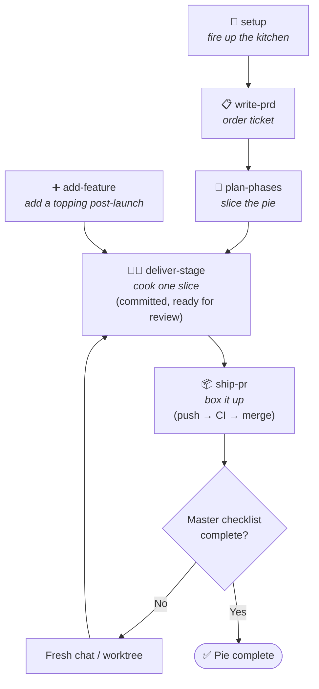

<!-- README.md -->
<!-- ByTheSlice — npm + GitHub README. Pizza-themed, structured for marketplace + GitHub readers. -->

<div align="center">

# 🍕 ByTheSlice

**Ship production apps the way you eat a pizza: one slice at a time.**

*One slice, one PR, one bite of confidence.*

[](https://www.npmjs.com/package/bytheslice)
[](LICENSE)
[](https://nodejs.org)
[](https://www.anthropic.com/claude-code)
[](https://cursor.com)
[](https://github.com/steve-piece/bytheslice/stargazers)

</div>

---

ByTheSlice is a Claude Code + Cursor plugin that takes a project from a free-form brief to a shipping production web app — one **vertical slice** at a time. No monolithic "go build this" prompts. No 200-file PRs nobody reads. Cut the product into slices, fire one out of the oven at a time, and don't ship anything you wouldn't taste-test yourself.

> [!TIP]
> **Pizza shop rules:** every slice goes through the same line — order ticket (PRD), recipe (plan), kitchen (subagents), quality station (lint / type / build + UAT), then box. If a slice doesn't pass quality, it doesn't leave the kitchen.

---

## Table of Contents

- [Why ByTheSlice](#why-bytheslice)
- [Quick Start](#quick-start)
- [Install](#install)
- [The Menu](#the-menu) — skills + slash commands
- [The Kitchen](#the-kitchen) — workflow diagram
- [Personalize](#personalize)
- [Conventions worth knowing](#conventions-worth-knowing)
- [Experimental skills](#experimental-skills)
- [FAQ](#faq)
- [Contributing](#contributing)
- [Repository](#repository)
- [License](#license)

---

## Why ByTheSlice

Most "build me an app with AI" workflows hit the same wall: too much scope per prompt, no real verification, no review surface, no way to roll back a bad slice without nuking the pie. ByTheSlice fixes that with three rules:

1. **Slice the pie before you cook.** A finalized PRD is decomposed into 20–30 vertical-slice stages plus 3–4 foundation stages (design system, CI/CD, env, optional DB schema). Each slice is **≤ 6 tasks, ~10–15 files**, completable in one fresh agent session.
2. **Every slice passes the quality station.** Lint / type / build are non-negotiable. Frontend slices also boot a dev server and run a Claude-in-Chrome browser UAT against design tokens. No "stage complete" report until the gates are green.
3. **Delivery is decoupled from shipping.** `/deliver-stage` stops at *slice committed locally, ready for review*. You taste-test (visual UAT, code review). Then `/ship-pr` boxes it: push, PR, CI watch with auto-fix loop, authorized merge, cleanup.

> [!IMPORTANT]
> ByTheSlice doesn't replace your judgment — it forces it. Every slice gives you a deliberate review window between commit and ship. **One slice, everybody knows the rules.**

---

## Quick Start

The fastest path from cold start to your first slice in production:

```bash
# 1. Install for both Claude Code + Cursor
npx bytheslice install --target both

# 2. (One-time) configure a system-wide default tier — optional
/bytheslice:setup     # in your IDE; pick your stack + preferences

# 3. New project → write the order ticket (PRD)
/bytheslice:write-prd

# 4. Slice the pie → master checklist + 20–30 stages
/bytheslice:plan-phases

# 5. Pull the next slice off the rack (run once per slice, fresh chat)
/bytheslice:deliver-stage

# 6. When the slice is taste-tested locally, box it up
/bytheslice:ship-pr
```

Repeat steps 5–6 until the master checklist is green. That's the whole motion.

> [!NOTE]
> Every command is also available without the `/bytheslice:` prefix in Claude Code if no other plugin claims it (e.g. `/deliver-stage`).

---

## Install

### Option 1 — Claude Code plugin (recommended)

```text
/add-plugin bytheslice
```

### Option 2 — npm CLI (scriptable, idempotent)

For automation, CI bootstraps, or devcontainers:

```bash
npx bytheslice install --target both
```

Default install paths:

- **Cursor:** `~/.cursor/plugins/local/bytheslice`
- **Claude Code:** `~/.claude/plugins/bytheslice`

Use `--target cursor` or `--target claude` to scope a single host. Override paths with `--cursor-dir <path>` / `--claude-dir <path>`.

### Option 3 — Run straight from GitHub (no npm install)

```bash
npx github:steve-piece/bytheslice install --target both
```

### Option 4 — Pick & choose individual skills

Install only selected skills + matching command shims (`skills.sh` style):

```bash
npx bytheslice install --mode skills --skill setup --skill deliver-stage
```

Selected skills land in:

- `./.bytheslice-installs/skills/skills/*`
- `./.bytheslice-installs/skills/commands/*`

Override the destination with `--skills-dir <path>`. For declarative installs, point `--config <path>` at a JSONC file (see [`scripts/install/skills-config.example.json`](scripts/install/skills-config.example.json)).

---

## The Menu

Each skill is invokable via slash command in Claude Code or Cursor. The full reference, sub-agents, and completion checklist for any skill live at `skills/<name>/SKILL.md`.

| Skill | Slash command | What it does |
|---|---|---|
| `setup` | `/bytheslice:setup` | Bootstraps a new project (single-app or Turborepo monorepo) or drops ByTheSlice config into an existing one. Auto-detects which flow you're in and checks for the CI/CD baseline. |
| `write-prd` | `/bytheslice:write-prd` | Turns a free-form project brief into a structured 8-section PRD (the **order ticket**). |
| `plan-phases` | `/bytheslice:plan-phases` | Decomposes a finalized PRD into a master checklist + foundation stages + 20–30 vertical-slice feature stages (the **recipe**). |
| `deliver-stage` | `/bytheslice:deliver-stage` | The everyday delivery loop. Routes by stage type, dispatches the right sub-skill or pipeline, runs spec/quality review + lint/type/build + a type-aware aggregating test review. **Stops at "slice committed locally, ready for review."** |
| `add-feature` | `/bytheslice:add-feature` | Bolts new features onto a project that already shipped. Assesses complexity, writes fresh stage files into the existing master checklist, commits the new plan files on a `chore/add-stages-...` branch, then hands off to `/ship-pr` or `/deliver-stage`. |
| `ship-pr` | `/bytheslice:ship-pr` | Pre-flight safety checks → push → open PR → watch CI (with `ci-fix-attempter` auto-fix loop on red, capped at 3 attempts) → user-authorized merge → main sync + branch + worktree cleanup. Universal closeout — works for slices from `deliver-stage`, plan-only chore PRs, or hand-rolled feature branches. |
| `walk-platform` | `/bytheslice:walk-platform` | Cross-cutting visual walkthrough of a running app. Discovers every route, drives a live browser, captures screenshots + console, and surfaces a ranked report of what's broken, mocked, or empty across the **whole product** — not just the last slice. Read-only. Run before UAT, before a demo, or after a batch of `/ship-pr` runs. Complements (does not replace) `deliver-stage`'s per-slice `visual-reviewer`. |
| `init-design-system` | `/bytheslice:init-design-system` | **Sub-skill of `deliver-stage`.** Validates or generates the design system. Auto-dispatched on `type: design-system` stages. |
| `scaffold-ci-cd` | `/bytheslice:scaffold-ci-cd` | **Sub-skill of `deliver-stage`.** Wires the CI/CD baseline. Auto-dispatched on `type: ci-cd` stages; invoke directly to repair CI. |
| `setup-environment` | `/bytheslice:setup-environment` | **Sub-skill of `deliver-stage`.** Walks external service setup and verifies `.env.local`. Auto-dispatched on `type: env-setup` stages. |

Two more skills (`run-pipeline`, `review-pipeline`) are documented under [Experimental skills](#experimental-skills).

---

## The Kitchen



`deliver-stage` is the daily surface. **Finish a slice, start a fresh chat, run it again** — until the checklist is green.

### Foundation stages (auto-dispatched by `deliver-stage`)

These run before any feature stage. Stage 4 only when the PRD has a backend.

| # | Stage | Sub-skill |
|---|---|---|
| 1 | Design system gate | `init-design-system` |
| 2 | CI/CD scaffold | `scaffold-ci-cd` |
| 3 | Environment setup gate | `setup-environment` |
| 4 | DB schema foundation *(conditional)* | `deliver-stage` internal implementer (DB context) |
| 5..N | Feature stages — vertical slices, 20–30 typical | `deliver-stage` internal pipeline (frontend / backend / full-stack) |

> [!NOTE]
> **Hard caps per stage:** 6 tasks, ~10–15 files changed, completable in one fresh agent session. Override `stages.maxTasksPerStage` in `bytheslice.config.json` if you really need a bigger slice — but the cap exists for a reason.

---

## Personalize

Drop a `bytheslice.config.json` at your project root to override defaults:

```jsonc
{
  "modelTiers":   { "implementer": "opus", "qualityReviewer": "opus" },
  "stages":       { "maxTasksPerStage": 6, "targetFeatureStages": "20-30" },
  "mcps":         { "shadcn": true, "magic": false, "figma": false, "chromeDevTools": true },
  "visualReview": { "tools": ["claude-in-chrome", "chrome-devtools-mcp", "playwright"], "vizzly": false },
  "hitl":         { "additionalCategories": [] },
  "rules":        { "imports": [] }
}
```

Full schema and precedence rules: [`skills/setup/references/bytheslice-config-schema.md`](skills/setup/references/bytheslice-config-schema.md). System-wide defaults live at `~/.bytheslice/defaults.json` (created during first-time install).

**Precedence (top wins):**

```
env vars  >  bytheslice.config.json  >  project rules file (CLAUDE.md / AGENTS.md)  >  plugin defaults
```

---

## Conventions worth knowing

> [!IMPORTANT]
> These aren't suggestions — they're the rules of the kitchen. The plugin enforces them.

- **Subagent-driven everything.** Skill files are orchestrators — context, scenarios, gates, agent rosters. Heavy work lives in `skills/*/agents/*.md`. The orchestrator dispatches, reviews structured outputs, and loops to green; it does not write production code itself.
- **Per-stage verification is non-negotiable.** Phase 6 (`basic-checks-runner`) and Phase 7 (`aggregating-test-reviewer`) gate the per-stage output summary. No "stage complete" report until both pass — or are intentionally skipped per stage type.
- **Library-first frontend delivery.** The design-system stage scaffolds an operator-only `/library` preview route at `app/(dashboard)/library/` (excluded from every nav surface, sitemap, and robots). Every frontend stage passes through Phase 4.5's **Library Preview Gate** — non-skippable for new components AND for consumer-side edits that change a user-visible surface (props, copy, content, variants, states, styles) of an existing library component. Pure internal refactors with no rendered-output delta are exempt.
- **Delivery and shipping are decoupled.** `deliver-stage` stops at *slice committed locally, ready for review* — push, PR, CI watch, merge, and cleanup belong to `ship-pr`. The split exists so you can run a manual visual UAT or local code review between commit and PR. `ship-pr` is also safe for hand-rolled feature branches that never went through ByTheSlice delivery.
- **Type-aware test review depth.** Frontend / full-stack stages get the FULL Phase 7 (dev-server boot, CI gates, Claude-in-Chrome UAT, visual diff). Backend / db-schema get a REDUCED review (CI gates only). Foundation stages skip Phase 7.
- **Always recommend a default in elicitation.** Every clarifying-questions phase across the plugin includes a recommended option in each choice set.
- **HITL bubbling.** Sub-agents never prompt the user directly — they return `needs_human: true` with one of four categories: `prd_ambiguity`, `external_credentials`, `destructive_operation`, `creative_direction`. Only top-level orchestrators surface the prompt.
- **Model tiers.** Three aliases (`haiku`, `sonnet`, `opus`); heavier tiers go to producing/verifying agents (`implementer` = `opus, xhigh`; `quality-reviewer` = `opus, high`). Full per-agent table at [`skills/setup/references/model-tier-guide.md`](skills/setup/references/model-tier-guide.md).
- **Visual review tooling priority** *(hardcoded, no discovery)*: Claude in Chrome > Chrome DevTools MCP > Playwright > Vizzly. Full-page screenshots only at 375 / 768 / 1280 / 1920 viewports.
- **One slice per PR.** Default branch naming: `feat/stage-<n>-<scope>`.

---

## Experimental skills

> [!WARNING]
> Not currently reliable in Claude Code or Cursor — agent attention drifts on long-running multi-stage tasks. Untested elsewhere; curious how they hold up in systems with stronger long-horizon multi-agent orchestration.

The intent: once `setup`, `write-prd`, `plan-phases`, and the design-system foundation are locked in — a coherent UI/UX language committed via `/library` — `/run-pipeline` lets the coding agent take over and dispatch `/deliver-stage` per slice fully autonomously until the master checklist is green. `/review-pipeline` follows shipping with a retrospective that drafts plugin improvements back to disk.

| Skill | Slash command | What it does |
|---|---|---|
| `run-pipeline` | `/bytheslice:run-pipeline` | Autonomous multi-stage variant of `deliver-stage`. Drives every remaining stage in one chat session. |
| `review-pipeline` | `/bytheslice:review-pipeline` | After a plan completes, surfaces friction patterns across recent stages and drafts improvements back to the plugin. |

---

## FAQ

<details>
<summary><b>Do I need both Claude Code and Cursor?</b></summary>

No. ByTheSlice works in either host on its own. `--target both` is just a convenience for people who jump between IDEs.

</details>

<details>
<summary><b>What's the smallest possible slice?</b></summary>

A slice has to be a real *user-facing* delta — UI + route + data + tests for one thing. The hard floor is roughly "one button that actually does something end-to-end." If you can't draw a user-visible bite out of it, it belongs as part of a foundation stage instead.

</details>

<details>
<summary><b>Can I skip the verification gates?</b></summary>

Technically yes (the orchestrator will accept a HITL override with `destructive_operation` category), but every story we've seen of "I'll just skip the gates this once" ends with a slice that breaks main. The whole point is that the kitchen doesn't ship slices it didn't taste.

</details>

<details>
<summary><b>What happens if a slice is too big?</b></summary>

`deliver-stage` will stop at the 6-task / ~15-file cap and return `needs_human: true` with category `prd_ambiguity` asking you to split the stage. Then re-run `plan-phases` against the same PRD with that stage flagged for further decomposition.

</details>

<details>
<summary><b>Does this work with non-Next.js stacks?</b></summary>

Today the bootstrap templates target Next.js (single-app or Turborepo monorepo). The verification gates and skill orchestration are stack-agnostic — point the implementer at any TypeScript repo and it'll route through the same Phase 6/7 gates. Bootstrap support for Vite, Remix, SvelteKit, and Expo is on the roadmap.

</details>

<details>
<summary><b>How do I uninstall?</b></summary>

```bash
rm -rf ~/.cursor/plugins/local/bytheslice ~/.claude/plugins/bytheslice
```

That's it. The plugin doesn't write anywhere else outside your project's `bytheslice.config.json`.

</details>

---

## Contributing

Contributions are welcome — especially if you've got real-world friction reports from running long plans.

```bash
# 1. Fork + clone
git clone https://github.com/<your-username>/bytheslice.git
cd bytheslice

# 2. Validate the package builds cleanly
npm pack --dry-run

# 3. Install your fork locally for live testing
node ./bin/bytheslice.js install --target both

# 4. Make your slice; commit on a branch
git checkout -b feat/<scope>
git commit -m "feat: <what changed>"

# 5. Push and open a PR
git push -u origin HEAD
```

The plugin eats its own cooking — internal changes go through the same `deliver-stage` → `ship-pr` motion. Run `/bytheslice:review-pipeline` after a release to surface friction and draft improvements back to the repo.

---

## Repository

- **GitHub:** [steve-piece/bytheslice](https://github.com/steve-piece/bytheslice)
- **npm:** [bytheslice](https://www.npmjs.com/package/bytheslice)
- **Changelog:** [CHANGELOG.md](CHANGELOG.md)
- **Issues:** [GitHub Issues](https://github.com/steve-piece/bytheslice/issues)

---

## License

[MIT](LICENSE) © Steven Light

<div align="center">

—

*Cut the pie. Cook one slice. Taste-test before it leaves the kitchen.*

🍕

</div>
