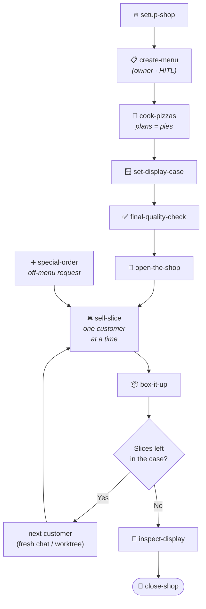

<!-- README.md -->
<!-- ByTheSlice — npm + GitHub README. Pizza-themed, structured for marketplace + GitHub readers. -->

<div align="center">

# 🍕 ByTheSlice

**A grab-and-go pizza shop for shipping software.**

*Plan today's menu. Prep the line. Bake one pie at a time, slide it onto the display tray, and keep service moving until the board is clear.*

[](https://www.npmjs.com/package/bytheslice)
[](LICENSE)
[](https://nodejs.org)
[](https://www.anthropic.com/claude-code)
[](https://cursor.com)
[](https://github.com/steve-piece/bytheslice/stargazers)

</div>

---

ByTheSlice is a Claude Code + Cursor plugin that runs your project like a **grab-and-go pizza shop**. You decide the day's menu, cook all the pies before service starts, build the display case, install the quality line, open the doors, then sell slices to customers (ship features) one at a time. Special orders cooked on the spot. No monolithic "go build this" prompts. No 200-file PRs nobody reads.

> [!TIP]
> **Shop rules:** every slice leaves the kitchen only after passing the quality line — lint, type, build, plus a type-aware aggregating test review for UI slices (dev server + browser UAT). If a slice fails inspection, it doesn't go in the display case.

---

## Table of Contents

- [Why ByTheSlice](#why-bytheslice)
- [Quick Start](#quick-start)
- [Install](#install)
- [The Menu](#the-menu) — skills + slash commands
- [The Kitchen](#the-kitchen) — workflow diagram
- [Personalize](#personalize)
- [Conventions worth knowing](#conventions-worth-knowing)
- [Experimental skills](#experimental-skills)
- [FAQ](#faq)
- [Contributing](#contributing)
- [Repository](#repository)
- [License](#license)

---

## Why ByTheSlice

Most "build me an app with AI" workflows hit the same wall: too much scope per prompt, no real verification, no review surface, no way to roll back a bad slice without nuking the pie. ByTheSlice fixes that with three rules:

1. **Prep before service.** Three run-once foundation skills (`/set-display-case`, `/final-quality-check`, `/open-the-shop`) get the kitchen ready before the doors open. Then `/cook-pizzas` portions the menu into 20–30 vertical-slice feature stages. Each slice is **≤ 6 tasks, ~10–15 files**, completable in one fresh agent session.
2. **Every slice passes the quality line.** Lint / type / build are non-negotiable. Frontend slices also boot a dev server and run a Claude-in-Chrome browser UAT against design tokens. No "stage complete" report until the gates are green.
3. **Selling is decoupled from boxing.** `/sell-slice` stops at *slice committed locally, ready for review*. You taste-test (visual UAT, code review). Then `/box-it-up` boxes it: push, PR, CI watch with auto-fix loop, authorized merge, cleanup.

> [!IMPORTANT]
> ByTheSlice doesn't replace your judgment — it forces it. Every slice gives you a deliberate review window between commit and ship. **One slice, everybody knows the rules.**

Every skill is also **invocable independently** — drop `/set-display-case` onto any project to bolt on a design system, or `/box-it-up` onto any feature branch to push and merge it. The full ByTheSlice motion is opt-in; the individual skills work standalone.

---

## Quick Start

The fastest path from cold start to your first slice in production:

```bash
# 1. Install for both Claude Code + Cursor
npx bytheslice install --target both

# 2. (One-time per machine) configure system-wide defaults — optional
/bytheslice:setup-shop     # in your IDE; pick your stack + preferences

# 3. New project → decide today's menu (PRD)
/bytheslice:create-menu

# 4. Cook the pre-made pies → master checklist + Prep section + 20–30 feature stages
/bytheslice:cook-pizzas

# 5. PREP THE LINE — run each once before service starts
/bytheslice:set-display-case      # design system, /library route
/bytheslice:final-quality-check   # CI/CD + E2E + visual-regression gates
/bytheslice:open-the-shop         # env vars + external service credentials

# 6. SERVICE — sell one slice at a time (fresh chat per slice)
/bytheslice:sell-slice
/bytheslice:box-it-up
```

Repeat step 6 until the master checklist is green. That's the whole motion.

**Special orders welcome:** `/bytheslice:special-order` adds new features mid-flight without restarting from a fresh PRD.

> [!NOTE]
> Every command is also available without the `/bytheslice:` prefix in Claude Code if no other plugin claims it (e.g. `/sell-slice`). The old v3 commands (`/deliver-stage`, `/ship-pr`, `/plan-phases`, etc.) still work for one release as backward-compat aliases.

---

## Install

### Option 1 — Claude Code plugin (recommended)

```text
/add-plugin bytheslice
```

### Option 2 — npm CLI (scriptable, idempotent)

For automation, CI bootstraps, or devcontainers:

```bash
npx bytheslice install --target both
```

Default install paths:

- **Cursor:** `~/.cursor/plugins/local/bytheslice`
- **Claude Code:** `~/.claude/plugins/bytheslice`

Use `--target cursor` or `--target claude` to scope a single host. Override paths with `--cursor-dir <path>` / `--claude-dir <path>`.

### Option 3 — Run straight from GitHub (no npm install)

```bash
npx github:steve-piece/bytheslice install --target both
```

### Option 4 — Pick & choose individual skills

Install only selected skills + matching command shims (`skills.sh` style):

```bash
npx bytheslice install --mode skills --skill setup-shop --skill sell-slice
```

Selected skills land in:

- `./.bytheslice-installs/skills/skills/*`
- `./.bytheslice-installs/skills/commands/*`

Override the destination with `--skills-dir <path>`. For declarative installs, point `--config <path>` at a JSONC file (see [`scripts/install/skills-config.example.json`](scripts/install/skills-config.example.json)).

---

## The Menu

Each skill is invokable via slash command in Claude Code or Cursor. The full reference, sub-agents, and completion checklist for any skill live at `skills/<name>/SKILL.md`. Every skill is **invocable independently** — drop one onto any project without needing the rest of the workflow.

### Daily prep (run-once per project)

| Skill | Slash command | What it does |
|---|---|---|
| `setup-shop` | `/bytheslice:setup-shop` | Start the oven, check ingredients, prep the shop. Bootstraps a new project (single-app or Turborepo monorepo) or drops ByTheSlice config into an existing one. |
| `create-menu` | `/bytheslice:create-menu` | Decide the day's pre-made pies. Turns a free-form project brief into a structured 8-section PRD. |
| `cook-pizzas` | `/bytheslice:cook-pizzas` | Cook the pre-made pies before the shop opens. Transforms a finalized PRD into a master checklist (with a top **Prep section**) plus 20–30 vertical-slice feature stages. Refuses to overwrite an existing checklist — use `/special-order` for that. |
| `set-display-case` | `/bytheslice:set-display-case` | Build the display case. Validates or generates the design system (tokens, Tailwind config, `/library` preview route). Standalone or sequential — flips `[ ] Display case built` in sequential mode. |
| `final-quality-check` | `/bytheslice:final-quality-check` | Install the quality line every pie passes through. Wires CI/CD + E2E + design-system-compliance + visual-regression baseline. Standalone or sequential — flips `[ ] Quality line installed`. |
| `open-the-shop` | `/bytheslice:open-the-shop` | Doors unlocked, OPEN sign up. Scans env requirements + verifies external service credentials. Most HITL-heavy step. Standalone or sequential — flips `[ ] Shop open`. |

### Service (run repeatedly, fresh chat per slice)

| Skill | Slash command | What it does |
|---|---|---|
| `sell-slice` | `/bytheslice:sell-slice` | The everyday delivery loop. Reads the master checklist, picks the next Not-Started feature stage, dispatches the right pipeline by stage type, runs spec/quality review + lint/type/build + a type-aware aggregating test review. **Stops at "slice committed locally, ready for review."** |
| `box-it-up` | `/bytheslice:box-it-up` | Box the slice and hand it across the counter. Pre-flight safety checks → push → open PR → watch CI (with `ci-fix-attempter` auto-fix loop on red, capped at 3 attempts) → user-authorized merge → main sync + branch + worktree cleanup. Universal closeout — works for ByTheSlice slices, plan-only chore PRs, or hand-rolled feature branches. |

### Side flows

| Skill | Slash command | What it does |
|---|---|---|
| `special-order` | `/bytheslice:special-order` | A walk-in wants something not on today's menu — cook it on the spot. Assesses complexity, writes fresh stage files extending the master checklist, hands off to `/sell-slice`. |
| `inspect-display` | `/bytheslice:inspect-display` | Walk the display tray and eyeball every pie. Cross-cutting visual walkthrough of a running app — discovers every route, drives a live browser, surfaces what's broken, mocked, or empty across the **whole product**. Read-only. Run before UAT, before a demo, or after a batch of `/box-it-up` runs. |

Two experimental skills (`run-the-day`, `close-shop`) are documented under [Experimental skills](#experimental-skills).

---

## The Kitchen



`sell-slice` is the daily surface. **Finish a slice, start a fresh chat, run it again** — until the master checklist is green.

### What happens in the master checklist

`cook-pizzas` produces `docs/plans/00_master_checklist.md` with two sections:

```markdown
## Prep — run once before any feature work

[ ] Display case built       — run /bytheslice:set-display-case
[ ] Quality line installed   — run /bytheslice:final-quality-check
[ ] Shop open                — run /bytheslice:open-the-shop
[ ] DB schema foundation     — run /bytheslice:sell-slice on stage 4 (if backend)

## Stages

## Stage 5 — <first feature stage>
...
```

`/sell-slice` refuses to start any feature stage until every Prep box is `[x]`. Each foundation skill flips its own checkbox when invoked in sequential mode.

> [!NOTE]
> **Hard caps per stage:** 6 tasks, ~10–15 files changed, completable in one fresh agent session. Override `stages.maxTasksPerStage` in `bytheslice.config.json` if you really need a bigger slice — but the cap exists for a reason.

---

## Personalize

Drop a `bytheslice.config.json` at your project root to override defaults:

```jsonc
{
  "modelTiers":   { "implementer": "opus", "qualityReviewer": "opus" },
  "stages":       { "maxTasksPerStage": 6, "targetFeatureStages": "20-30" },
  "mcps":         { "shadcn": true, "magic": false, "figma": false, "chromeDevTools": true },
  "visualReview": { "tools": ["claude-in-chrome", "chrome-devtools-mcp", "playwright"], "vizzly": false },
  "hitl":         { "additionalCategories": [] },
  "rules":        { "imports": [] }
}
```

Full schema and precedence rules: [`skills/setup/references/bytheslice-config-schema.md`](skills/setup/references/bytheslice-config-schema.md). System-wide defaults live at `~/.bytheslice/defaults.json` (created during first-time install).

**Precedence (top wins):**

```
env vars  >  bytheslice.config.json  >  project rules file (CLAUDE.md / AGENTS.md)  >  plugin defaults
```

---

## Conventions worth knowing

> [!IMPORTANT]
> These aren't suggestions — they're the rules of the kitchen. The plugin enforces them.

- **Subagent-driven everything.** Skill files are orchestrators — context, scenarios, gates, agent rosters. Heavy work lives in `skills/*/agents/*.md`. The orchestrator dispatches, reviews structured outputs, and loops to green; it does not write production code itself.
- **Per-stage verification is non-negotiable.** Phase 6 (`basic-checks-runner`) and Phase 7 (`aggregating-test-reviewer`) gate the per-stage output summary. No "stage complete" report until both pass — or are intentionally skipped per stage type.
- **Preview-first library delivery.** The design-system stage scaffolds an operator-only `/library` preview route at `app/(dashboard)/library/` (excluded from every nav surface, sitemap, and robots) with `?tab=<id>` query-param routing — one page route validates the param against `LIBRARY_TABS`, dispatches via a typed `STORIES` map, and renders one of N `_entries/<id>-entry.tsx` files. The scaffold ships `<EntryHeader>` / `<EntrySection>` server-component helpers and an `<EntrySourceCopy>` `'use client'` icon-button island; every entry's H1 and every state H3 render a copy-Markdown-link button so the operator can paste a clickable link like `[Disabled](components/ui/button.tsx:42-58)` straight into a Claude Code chat and scope edits to the exact file and line range. Every frontend stage passes through Phase 4.5's **Library Preview Gate** — non-skippable for new components AND for consumer-side edits that change a user-visible surface of an existing library component. The gate runs a Phase 0 extend-vs-create check, surfaces a self-critique block + clickable `http://localhost:<port>/library?tab=<id>` URLs, then HARD STOPS for explicit user approval before any production-route import lands. Pure internal refactors with no rendered-output delta are exempt.
- **Selling and boxing are decoupled.** `sell-slice` stops at *slice committed locally, ready for review* — push, PR, CI watch, merge, and cleanup belong to `box-it-up`. The split exists so you can run a manual visual UAT or local code review between commit and PR. `box-it-up` is also safe for hand-rolled feature branches that never went through ByTheSlice delivery.
- **Type-aware test review depth.** Frontend / full-stack stages get the FULL Phase 7 (dev-server boot, CI gates, Claude-in-Chrome UAT, visual diff). Backend / db-schema get a REDUCED review (CI gates only). Foundation stages skip Phase 7.
- **Always recommend a default in elicitation.** Every clarifying-questions phase across the plugin includes a recommended option in each choice set.
- **HITL bubbling.** Sub-agents never prompt the user directly — they return `needs_human: true` with one of four categories: `prd_ambiguity`, `external_credentials`, `destructive_operation`, `creative_direction`. Only top-level orchestrators surface the prompt.
- **Model tiers.** Three aliases (`haiku`, `sonnet`, `opus`); heavier tiers go to producing/verifying agents (`implementer` = `opus, xhigh`; `quality-reviewer` = `opus, high`). Full per-agent table at [`skills/setup/references/model-tier-guide.md`](skills/setup/references/model-tier-guide.md).
- **Visual review tooling priority** *(hardcoded, no discovery)*: Claude in Chrome > Chrome DevTools MCP > Playwright > Vizzly. Full-page screenshots only at 375 / 768 / 1280 / 1920 viewports.
- **One slice per PR.** Default branch naming: `feat/stage-<n>-<scope>`.

---

## Experimental skills

> [!WARNING]
> Not currently reliable in Claude Code or Cursor — agent attention drifts on long-running multi-stage tasks. Untested elsewhere; curious how they hold up in systems with stronger long-horizon multi-agent orchestration.

The intent: once daily prep is locked in (`setup-shop` → `create-menu` → `cook-pizzas` → `set-display-case` → `final-quality-check` → `open-the-shop`), `/run-the-day` lets the coding agent take over and dispatch `/sell-slice` per slice fully autonomously until the master checklist is green. `/close-shop` follows shipping with an after-service retrospective that drafts plugin improvements back to disk.

v4 adds **`/goal` integration** in `/run-the-day`'s `--auto-*` modes — Phase 0.5 sets a session-scoped goal whose condition encodes the pipeline's end state, and a prompt-based Stop hook (default Haiku) checks it between turns. HITL pauses still end turns cleanly. See [`skills/run-the-day/SKILL.md`](skills/run-the-day/SKILL.md) Phase 0.5 for the goal-condition strings per mode.

| Skill | Slash command | What it does |
|---|---|---|
| `run-the-day` | `/bytheslice:run-the-day` | Autonomous multi-stage variant of `sell-slice`. Drives every remaining stage in one chat session. Supports periodic platform-walk checkpoints — set `runPipeline.platformWalkEvery: 5` in `bytheslice.config.json` to dispatch `/inspect-display` every 5 stages and catch cross-cutting regressions before they compound. |
| `close-shop` | `/bytheslice:close-shop` | After a plan completes, surfaces friction patterns across recent stages and drafts improvements back to the plugin. Bookends `/setup-shop`. |

---

## FAQ

<details>
<summary><b>Do I need both Claude Code and Cursor?</b></summary>

No. ByTheSlice works in either host on its own. `--target both` is just a convenience for people who jump between IDEs.

</details>

<details>
<summary><b>What's the smallest possible slice?</b></summary>

A slice has to be a real *user-facing* delta — UI + route + data + tests for one thing. The hard floor is roughly "one button that actually does something end-to-end." If you can't draw a user-visible bite out of it, it belongs as part of a foundation stage instead.

</details>

<details>
<summary><b>Can I skip the verification gates?</b></summary>

Technically yes (the orchestrator will accept a HITL override with `destructive_operation` category), but every story we've seen of "I'll just skip the gates this once" ends with a slice that breaks main. The whole point is that the kitchen doesn't ship slices it didn't taste.

</details>

<details>
<summary><b>What happens if a slice is too big?</b></summary>

`sell-slice` will stop at the 6-task / ~15-file cap and return `needs_human: true` with category `prd_ambiguity` asking you to split the stage. Then re-run `cook-pizzas` against the same PRD with that stage flagged for further decomposition (or use `/special-order` to add a refined split).

</details>

<details>
<summary><b>Does this work with non-Next.js stacks?</b></summary>

Today the bootstrap templates target Next.js (single-app or Turborepo monorepo). The verification gates and skill orchestration are stack-agnostic — point the implementer at any TypeScript repo and it'll route through the same Phase 6/7 gates. Bootstrap support for Vite, Remix, SvelteKit, and Expo is on the roadmap.

</details>

<details>
<summary><b>How do I uninstall?</b></summary>

```bash
rm -rf ~/.cursor/plugins/local/bytheslice ~/.claude/plugins/bytheslice
```

That's it. The plugin doesn't write anywhere else outside your project's `bytheslice.config.json`.

</details>

---

## Contributing

Contributions are welcome — especially if you've got real-world friction reports from running long plans.

```bash
# 1. Fork + clone
git clone https://github.com/<your-username>/bytheslice.git
cd bytheslice

# 2. Validate the package builds cleanly
npm pack --dry-run

# 3. Install your fork locally for live testing
node ./bin/bytheslice.js install --target both

# 4. Make your slice; commit on a branch
git checkout -b feat/<scope>
git commit -m "feat: <what changed>"

# 5. Push and open a PR
git push -u origin HEAD
```

The plugin eats its own cooking — internal changes go through the same `sell-slice` → `box-it-up` motion. Run `/bytheslice:close-shop` after a release to surface friction and draft improvements back to the repo.

---

## Repository

- **GitHub:** [steve-piece/bytheslice](https://github.com/steve-piece/bytheslice)
- **npm:** [bytheslice](https://www.npmjs.com/package/bytheslice)
- **Changelog:** [CHANGELOG.md](CHANGELOG.md)
- **Issues:** [GitHub Issues](https://github.com/steve-piece/bytheslice/issues)

---

## License

[MIT](LICENSE) © Steven Light

<div align="center">

—

*Cut the pie. Cook one slice. Taste-test before it leaves the kitchen.*

🍕

</div>
