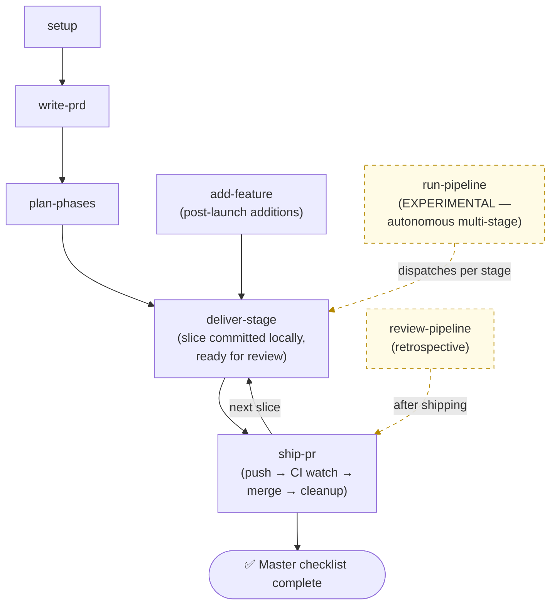

# Stagecoach

> A Claude Code plugin that takes a project from a free-form brief to a shipping production web app through a phased, subagent-driven workflow.

Stagecoach v3 collapses everyday delivery into a single command — `/stagecoach:deliver-stage` — that reads the master checklist, picks the next stage, routes by stage type, runs the right pipeline, and opens a PR after a real verification gate (lint/type/build + a type-aware aggregating test review including dev-server boot and Claude-in-Chrome browser UAT for frontend slices).

Every heavy workflow step is a subagent. Skill files are orchestrator-only — context, scenarios, user-input gates, references, and a roster of specialized agents. The agents do the actual work.

---

## Install

```text
/add-plugin stagecoach
```

Or clone manually: `git clone https://github.com/steve-piece/stagecoach.git` and add it as a plugin via your project rules file.

---

## Workflow

The everyday loop, step by step:

- **setup** — Bootstraps a new project (or drops config into an existing one) and checks the CI/CD baseline.
- **write-prd** — Turns a free-form project brief into a structured PRD.
- **plan-phases** — Decomposes the PRD into a master checklist, three foundation stages (plus an optional db-schema stage), and 20–30 feature stages.
- **deliver-stage** — The everyday delivery loop. Run once per slice, in a fresh chat, until the master checklist is done. Routes by stage `type:` and dispatches the right sub-skill (init-design-system / scaffold-ci-cd / setup-environment) or internal pipeline (frontend / backend / full-stack / db-schema). Frontend stages also pass through a non-skippable **Library Preview Gate** (Phase 4.5) — every new component AND every consumer-side edit that changes a user-visible surface of an existing library component gets staged into the operator-only `/library` route for explicit user approval before any production-route edit lands. Gates the PR on lint/type/build + a type-aware aggregating test review. **Stops at "slice committed locally, ready for review"** — push, PR, CI watch, merge, and cleanup are handed off to `/ship-pr` so you can run a manual visual UAT first.
- **add-feature** — Skip ahead. Bolts new stages directly onto a project that already shipped, commits the new plan files on a `chore/add-stages-...` branch, then hands off to `/ship-pr` (chore PR) or `/deliver-stage` (start delivery).
- **ship-pr** — Take a feature branch with locally-committed work and ship it: pre-flight safety checks → push → PR open → CI watch (with auto-fix loop on red, capped at 3 attempts) → user-authorized merge → main sync + branch and worktree cleanup. Decoupled from `deliver-stage` and `add-feature` so you can review or UAT the slice locally before deciding to ship.



Two ways in: build a fresh project end-to-end starting from `setup`, or add features to an already-shipped project starting from `add-feature`. Either way, **`deliver-stage` is the everyday delivery surface.** Run it, finish a slice, start a fresh chat, run it again. The dashed-line sidecars (`run-pipeline`, `review-pipeline`) are experimental — they wrap or follow `deliver-stage` rather than replace it.

**Foundation stages** (run before any feature stage; Stage 4 only when the PRD has a backend) are dispatched automatically by `deliver-stage` based on each stage's `type:` frontmatter:

| # | Stage | Sub-skill dispatched by `deliver-stage` |
|---|---|---|
| 1 | Design system gate | `init-design-system` |
| 2 | CI/CD scaffold | `scaffold-ci-cd` |
| 3 | Environment setup gate | `setup-environment` |
| 4 | DB schema foundation (conditional) | `deliver-stage` internal implementer (DB context) |
| 5..N | Feature stages (vertical slices, 20–30 typical) | `deliver-stage` internal pipeline (frontend / backend / full-stack) |

Hard caps per stage: **6 tasks**, ~10–15 files changed, completable in one fresh agent session. Override `stages.maxTasksPerStage` in `stagecoach.config.json`.

---

## Skills

| Skill | Slash command | Description |
|---|---|---|
| `setup` | `/stagecoach:setup` | Bootstraps a new project or drops Stagecoach config into an existing one. Auto-detects which flow you're in and checks for the CI/CD baseline. |
| `write-prd` | `/stagecoach:write-prd` | Turns a free-form project brief into a structured 8-section PRD. |
| `plan-phases` | `/stagecoach:plan-phases` | Decomposes a finalized PRD into a master checklist, foundation stages, and 20–30 vertical-slice feature stages. |
| `deliver-stage` | `/stagecoach:deliver-stage` | The everyday delivery loop. Routes by stage type, dispatches the right sub-skill or internal pipeline, runs spec/quality review + basic checks (lint/type/build) + a type-aware aggregating test review. **Stops at "slice committed locally, ready for review"** — hands off to `/ship-pr` for push / PR / merge / cleanup. |
| `add-feature` | `/stagecoach:add-feature` | Bolts new features onto a project that already shipped, assessing complexity and writing fresh stage files into the existing master checklist. Commits the new plan files on a `chore/add-stages-...` branch, then hands off to `/ship-pr` or `/deliver-stage`. |
| `ship-pr` | `/stagecoach:ship-pr` | Pre-flight safety checks → push → open PR → watch CI (with `ci-fix-attempter` auto-fix loop on red, capped at 3 attempts) → user-authorized merge → main sync + local and remote branch deletion + worktree removal. Universal closeout — works for slices from `deliver-stage`, plan-only chore PRs from `add-feature`, or hand-rolled feature branches. |
| `init-design-system` | `/stagecoach:init-design-system` | **Sub-skill of `deliver-stage`.** Validates or generates the design system. Auto-dispatched on `type: design-system` stages; invoke directly only as an escape hatch. |
| `scaffold-ci-cd` | `/stagecoach:scaffold-ci-cd` | **Sub-skill of `deliver-stage`.** Wires the CI/CD baseline. Auto-dispatched on `type: ci-cd` stages; invoke directly to repair CI manually. |
| `setup-environment` | `/stagecoach:setup-environment` | **Sub-skill of `deliver-stage`.** Walks external service setup and verifies `.env.local`. Auto-dispatched on `type: env-setup` stages; invoke directly to re-verify env state. |
| `run-pipeline` *(experimental)* | `/stagecoach:run-pipeline` | Autonomous multi-stage variant of `deliver-stage`. Drives every remaining stage in one chat session. Use only when you explicitly want autonomous multi-stage delivery and accept the reliability tradeoff. |
| `review-pipeline` *(experimental)* | `/stagecoach:review-pipeline` | After a plan completes, surfaces friction patterns across recent stages and drafts improvements back to the plugin. |

Each skill's full reference, sub-agents, and completion checklist live in `skills/<name>/SKILL.md`.

---

## Personalize

Drop a `stagecoach.config.json` at your project root to override defaults:

```jsonc
{
  "modelTiers":   { "implementer": "opus", "qualityReviewer": "opus" },
  "stages":       { "maxTasksPerStage": 6, "targetFeatureStages": "20-30" },
  "mcps":         { "shadcn": true, "magic": false, "figma": false, "chromeDevTools": true },
  "visualReview": { "tools": ["claude-in-chrome", "chrome-devtools-mcp", "playwright"], "vizzly": false },
  "hitl":         { "additionalCategories": [] },
  "rules":        { "imports": [] }
}
```

Full schema + precedence rules at [`skills/setup/references/stagecoach-config-schema.md`](skills/setup/references/stagecoach-config-schema.md). System-wide defaults via `~/.stagecoach/defaults.json` (created during first-time install).

**Precedence (top wins):** env vars → `stagecoach.config.json` → project rules file (CLAUDE.md / AGENTS.md) → plugin defaults.

---

## Conventions worth knowing

- **Subagent-driven everything.** Skill files are orchestrators — context, scenarios, gates, agent rosters. Heavy work lives in `skills/*/agents/*.md`. The orchestrator dispatches, reviews structured outputs, and loops to green; it does not write production code itself.
- **Per-stage verification is non-negotiable.** Phase 6 (basic-checks-runner) and Phase 7 (aggregating-test-reviewer) gate the output summary in `deliver-stage`. No "stage complete" report until both pass (or are intentionally skipped per stage type).
- **Library-first frontend delivery.** The design-system stage scaffolds an operator-only `/library` preview route at `app/(dashboard)/library/` (excluded from every nav surface, sitemap, and robots). Every frontend stage passes through Phase 4.5's Library Preview Gate — non-skippable for new components AND for consumer-side edits that change a user-visible surface (props, copy, content, variants, states, styles) of an existing library component. Pure internal refactors with no rendered-output delta are exempt.
- **Delivery and shipping are decoupled.** `deliver-stage` stops at "slice committed locally, ready for review" — push, PR, CI watch, merge, and cleanup belong to `ship-pr`. The split exists so you can run a manual visual UAT or local code review between commit and PR. `ship-pr` is also safe for hand-rolled feature branches that never went through Stagecoach delivery.
- **Type-aware test review depth.** Frontend / full-stack stages get the FULL Phase 7 (dev-server boot, CI gates, Claude-in-Chrome UAT, visual diff). Backend / db-schema get a REDUCED review (CI gates only). Foundation stages skip Phase 7.
- **Always recommend a default in elicitation.** Every clarifying-questions phase across the plugin includes a recommended option in each choice set.
- **HITL bubbling.** Sub-agents never prompt the user directly — they return `needs_human: true` with one of four categories: `prd_ambiguity`, `external_credentials`, `destructive_operation`, `creative_direction`. Only top-level orchestrators call `ask_user_input_v0`.
- **Model tiers.** Three aliases (`haiku`, `sonnet`, `opus`); heavier tiers go to producing/verifying agents (`implementer` = `opus, xhigh`; `quality-reviewer` = `opus, high`). Full per-agent table at [`skills/setup/references/model-tier-guide.md`](skills/setup/references/model-tier-guide.md).
- **Visual review tooling priority** (hardcoded, no discovery): Claude in Chrome > Chrome DevTools MCP > Playwright > Vizzly. Full-page screenshots only at 375 / 768 / 1280 / 1920 viewports.
- **One slice per PR.** Default branch naming: `feat/stage-<n>-<scope>`.

---

## Repository

- GitHub: [steve-piece/stagecoach](https://github.com/steve-piece/stagecoach)
- Changelog: [CHANGELOG.md](CHANGELOG.md)

## License

MIT
