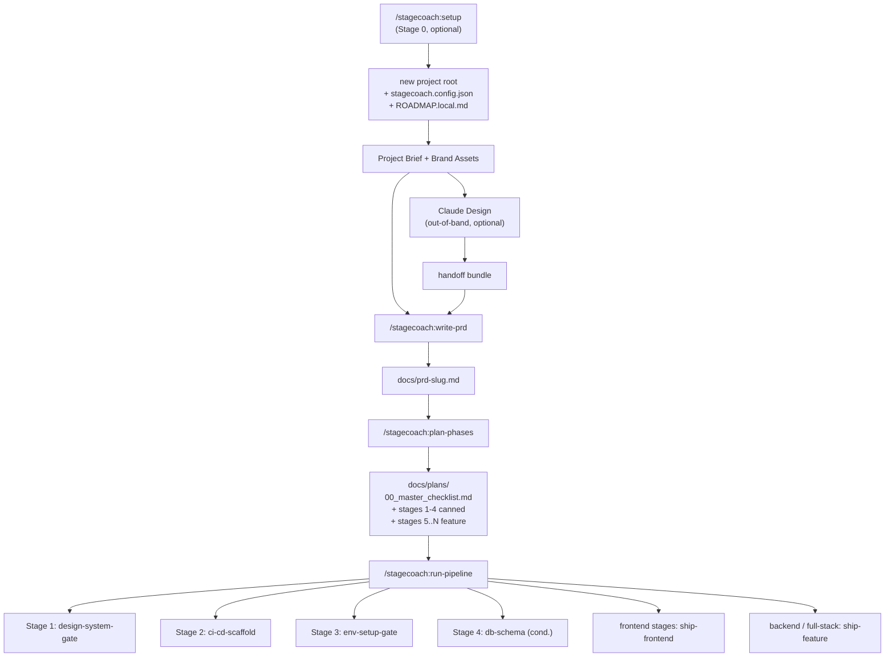
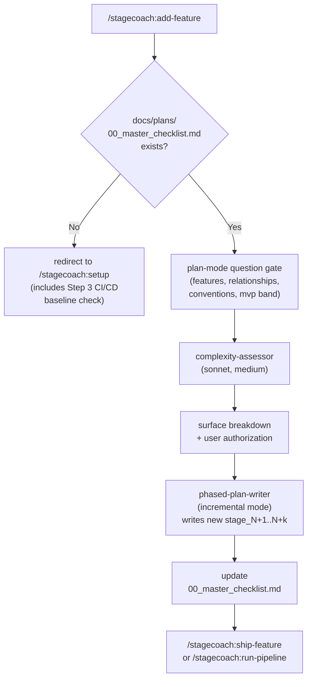

# Stagecoach

Stagecoach is a Claude Code plugin that takes a project from a free-form brief to a shipping production web app through a phased, multi-agent workflow.

## Introduction

Stagecoach is a Claude Code plugin that drives an AI agent — and the human in the loop — stage-by-stage through end-to-end web project delivery. From a free-form brief, Stagecoach generates a structured PRD, decomposes it into phased plans, and ships through canonical foundation stages (design system → CI/CD → environment setup → optional database schema) before delivering 20–30 vertical-slice feature stages with embedded visual, design-system-compliance, and database-schema-drift CI gates. Outputs are production-grade web apps — single-application or Turborepo monorepo — with cohesive token-driven design across surfaces, env-verified deploys, and schema-aware migrations. Stagecoach intentionally pauses only at four well-defined human-in-the-loop categories — PRD ambiguity, external credentials, destructive operations, and subjective creative direction — so the agent never blocks on questions it could reasonably answer itself.

## Installation

### Claude Code (Plugin Marketplace)

```text
/add-plugin stagecoach
```

Or search for "stagecoach" in the Claude Code plugin marketplace.

> **Pre-publish note:** until the GitHub repo is renamed and pushed to the marketplace, install via the manual route below.

### Manual

Clone this repo:

```bash
git clone https://github.com/steve-piece/phased-dev-workflow.git
```

Then add it as a plugin via your project's rules file (cursor or claude).

## Slash command convention

All Stagecoach slash commands are auto-namespaced under `stagecoach:` once the plugin is installed via the marketplace — for example, `/stagecoach:write-prd`, `/stagecoach:run-pipeline`, `/stagecoach:setup`. The bare form (`/write-prd`) also works in local dev / pre-publish testing. Throughout this README we use the published form.

## Workflow



### The high-level loop

0. **`/stagecoach:setup`** (optional, Stage 0) scaffolds a new Next.js single-app or Turborepo monorepo, drops in `stagecoach.config.json`, and creates a gitignored `ROADMAP.local.md`. Skip if you already have a project on disk.
1. **`/stagecoach:write-prd`** turns a brief (and optional Claude Design handoff bundle) into `docs/prd-<slug>.md`.
2. **`/stagecoach:plan-phases`** decomposes the PRD into `docs/plans/00_master_checklist.md` plus four canned foundation stages and 20–30 vertical-slice feature stages. Linear is optional — a question gate in this skill asks whether to mirror to issue-tracking.
3. **`/stagecoach:run-pipeline`** drives the entire plan end-to-end. For each stage it dispatches a `stage-runner` subagent that loads the right skill, verifies the result via a `pr-reviewer` subagent, and advances only after a clean `main`.

### Adding features after the original plan ships

Once the original PRD-to-app run is complete (every stage in the master checklist marked `Completed`), use **`/stagecoach:add-feature`** to bolt on additional features without rewriting the whole plan:



The new stages flow through the same `ship-feature` pipeline as the original work, so they get the full CI gate (`@feature` + `@regression-core` + `@visual` + design-system-compliance + `db-schema-drift` if applicable). For non-Stagecoach apps that want to use Stagecoach for incremental feature delivery, run `/stagecoach:setup` first — Step 3 (new in v2.2) checks for the CI/CD baseline and offers to scaffold it.

## Stage Architecture

### Stage 0 — Setup (entry point for every Stagecoach project)

| Stage | Name | Skill | Notes |
|-------|------|-------|-------|
| 0 | setup | `setup` | Three flows in one skill: (A) first-time install creates `~/.stagecoach/defaults.json`; (B) new project bootstraps via `create-next-app` / `create-turbo` AND drops in per-project `stagecoach.config.json`; (C) existing project skips bootstrap, drops in per-project config only. |

### Foundation stages (always run, in order)

| Stage | Name | Skill | Notes |
|-------|------|-------|-------|
| 1 | design-system-gate | `init-design-system` | Generates or validates the token-driven design system; blocks feature work until compliant |
| 2 | ci-cd-scaffold | `scaffold-ci-cd` | Bootstraps Playwright suites, GitHub Actions, Husky pre-push, PR template, branch protection |
| 3 | env-setup-gate | `setup-environment` | External account setup + `.env.local` population; env-verified before feature stages begin |
| 4 | db-schema-foundation | `ship-feature` (DB context) | Conditional — only emitted when the PRD includes a database. Sets schema baseline + migration tooling |

### Feature stages (5..N — 20–30 typical)

Each feature stage is a vertical slice: UI + route + data + tests in a single PR. Every feature stage embeds its own completion checklist and CI gates. Stages are grouped as shell (route, layout, empty/loading/error states) + data (queries, mutations, polish) by default.

Hard caps per stage: **6 tasks**, ~10–15 files changed, completable in one fresh agent session. Override `stages.maxTasksPerStage` in `stagecoach.config.json` if needed.

## Skills

### setup

Stage 0 — Stagecoach's entry point. Three flows in one skill:

- **Flow A (first-time install):** Creates `~/.stagecoach/defaults.json` so future projects can opt in to your defaults via a single Group 1 question.
- **Flow B (new project):** Scaffolds a fresh Next.js single-app or Turborepo monorepo via the official scaffolders, drops in `stagecoach.config.json`, and creates a gitignored `ROADMAP.local.md`.
- **Flow C (existing project):** Skips the bootstrap, drops in `stagecoach.config.json` only.

**Bundled references:**
- `references/stagecoach-config-schema.md` — full config schema + precedence rules
- `references/stagecoach.config.example.json` — copy-pasteable JSONC starter
- `references/model-tier-guide.md` — per-agent model tier defaults
- `references/bootstrap-templates-catalog.md` — which scaffolders Step 1 wraps and why

### `write-prd`

Generate a complete PRD from a free-form project brief. Plan-mode question gate (3–7 clarifying questions) before writing. Outputs a single markdown file with all eight sections (0 through 7). A `prd-reviewer` subagent runs automatically as the final step, with a 2-iteration revision loop before bubbling up via HITL.

**Bundled references:**
- `references/prd-template-v2.md` — canonical 8-section structure
- `references/project-defaults.md` — default tech stack, services, conventions, token category contract

**Dispatched subagents:**
- `prd-reviewer` — validates spec completeness against source materials

### plan-phases

Decompose a PRD into a master checklist and per-stage implementation files. Runs a 12-question Context Elicitation phase, emits four canned foundation stage files, and writes 20–30 vertical-slice feature stages via `phased-plan-writer`. The `master-checklist-synthesizer` subagent aggregates `completion_criteria` from every stage frontmatter into `00_master_checklist.md`.

**Bundled references:**
- `references/templates.md` — master checklist + stage plan templates
- `references/architecture-conventions.md` — opinion-free baseline (web standards, performance facts, structural variants, conditional security + framework facts)
- `references/stage-frontmatter-contract.md` — required YAML frontmatter shape
- `references/canned-stages/` — canned files for stages 1–4 + the auth dev-mode switcher snippet

**Dispatched subagents:**
- `design-system-stage-writer` — stage 1
- `ci-cd-scaffold-stage-writer` — stage 2
- `env-setup-stage-writer` — stage 3
- `db-schema-stage-writer` — stage 4 (conditional)
- `phased-plan-writer` — one invocation per feature stage (5..N), in parallel
- `master-checklist-synthesizer` — aggregates completion criteria

### init-design-system

Validate or generate a token-driven design system before any feature work. Bundle-first (Claude Design export) or brief-first (token-expander Opus pass) modes. Compliance pre-check blocks the orchestrator from advancing to Stage 2 until every token category is satisfied.

**Dispatched subagents:**
- `bundle-validator` — validates incoming handoff bundle structure
- `token-expander` — expands brand primitives into a full token set (opus, high)
- `compliance-pre-check` — verifies token coverage against the checklist

### setup-environment

Human-in-the-loop gate that ensures all external services are provisioned and `.env.local` is fully populated before feature stages begin. Generates a manual checklist per detected service (Supabase, Stripe, Resend, etc.) with direct links to provisioning consoles. The `env-verifier` subagent mechanically scans `.env.local` against expected keys without ever logging values.

**Bundled references:**
- `references/env-checklist-template.md`
- `references/known-services-catalog.md` — extensible service prefix catalog

**Dispatched subagents:**
- `env-verifier` — mechanical `.env.local` scan; never reads values

### scaffold-ci-cd

Bootstrap a production-grade CI/CD + E2E + design-system-compliance + visual regression baseline on a dedicated `chore/scaffold-ci-cd` branch. Creates Playwright `@feature` / `@regression-core` / `@visual` suites, GitHub Actions (including `design-system-compliance.yml` and `db-schema-drift.yml` conditional), Husky `pre-push`, PR template, and branch-protection setup script. Completion checklist embedded.

**Bundled references:**
- `references/scaffold-artifact-templates.md` — verbatim file templates for every artifact

### ship-frontend

Deliver `type: frontend` feature stages via a six-agent visual pipeline. Block-composer runs BEFORE component-crafter (composes from shadcn blocks before authoring custom). Visual-reviewer uses a hardcoded 4-tier tooling priority (Claude in Chrome > Chrome DevTools MCP > Playwright > Vizzly) with full-page-only screenshots at four viewports.

**Dispatched subagents:**
- `modern-ux-expert` — UX pattern selection + reference research
- `layout-architect` — shell-level layout decisions
- `block-composer` — shadcn block composition (HARD-FIRST rule)
- `component-crafter` — token-only component authoring (conditional)
- `state-illustrator` — loading / empty / error / success state coverage
- `visual-reviewer` — vision pass against design system + UX spec

Reuses `discovery`, `spec-reviewer`, `quality-reviewer`, `ci-cd-guardrails` from `ship-feature`.

### ship-feature

Orchestrate `type: backend | full-stack | infrastructure | db-schema` feature stages via a parallel-subagent pipeline. Implementer runs at `opus, xhigh`; quality-reviewer at `opus, high`; CI guardrails at `sonnet, medium` (per the [model tier preference](skills/setup/references/model-tier-guide.md)). For DB-touching stages, the implementer MUST update `db/schema.sql` (or equivalent declarative source) BEFORE writing migration or query code; the quality-reviewer verifies this.

**Dispatched subagents:**
- `discovery` — codebase + GitNexus reconnaissance (haiku)
- `checklist-curator` — slice scoping + checklist diff (sonnet)
- `implementer` — slice implementation (opus, xhigh)
- `spec-reviewer` — spec compliance check (sonnet)
- `quality-reviewer` — code quality + DB schema verification (opus, high)
- `ci-cd-guardrails` — CI/CD safety pass (sonnet, medium)

### add-feature

Bolt new features onto an existing project mid-flight. Auto-detects whether the project was built with Stagecoach (`docs/plans/00_master_checklist.md` present) or not. For Stagecoach projects: runs the `complexity-assessor` subagent to judge single-stage vs multi-stage per feature, surfaces the proposed breakdown for user authorization, then dispatches `phased-plan-writer` in incremental mode to write the new stage files (continuing the existing stage numbering) and updates the master checklist. Hands off to `/stagecoach:ship-feature` (single stage) or `/stagecoach:run-pipeline` (multiple stages) for delivery — both exercise the full CI gate. For non-Stagecoach apps, redirects to `/stagecoach:setup` (which now includes a Step 3 CI/CD baseline check for apps not going through the full PRD-to-phased-dev workflow).

**Dispatched subagents:**
- `complexity-assessor` — sonnet, medium; judges single-stage vs multi-stage and proposes the per-feature stage breakdown (read-only)
- `phased-plan-writer` (incremental mode, borrowed from `plan-phases`) — sonnet, medium; writes one stage file per invocation

### run-pipeline

Drive an entire phased plan end-to-end as a conductor (NOT autopilot). Reads the master checklist, dispatches the correct skill per stage `type`, verifies each PR via a `pr-reviewer` subagent, enforces the clean-`main` invariant between stages. The orchestrator is the **only** surface that prompts the human — all subagents bubble HITL triggers up via the structured return contract.

See [Orchestrator Modes](#orchestrator-modes) below.

**Bundled references:**
- `references/per-stage-prompt-template.md`

**Dispatched subagents:**
- `stage-runner` — opus, high; runs one stage end-to-end via the correct skill
- `pr-reviewer` — sonnet; readonly post-merge sanity check (verifies design-system-compliance, visual diffs, db/schema.sql update, env-setup gate completion)

### review-pipeline (experimental)

Cross-stage friction detection after a full plan completes. Reads the master checklist, all stage files, recent commits, and HITL escalations to surface patterns: repeated HITL triggers, recurring CI failures, scope drift. Drafts improvement PRs back to the plugin repo. Invoked manually after all stages — never called by the orchestrator. Self-modification guard prevents the skill from drafting changes to itself (avoids recursion).

**Dispatched subagents:**
- `retrospective-reviewer` — opus, high; cross-stage pattern detection

## Slash Commands

| Command (published form) | Skill loaded | When to use |
|---|---|---|
| `/stagecoach:setup` | `setup` | Stage 0 — first-time install, new-project scaffold, OR per-project config + CI/CD baseline check (auto-detects flow) |
| `/stagecoach:write-prd` | `write-prd` | Turn a free-form brief into a structured PRD |
| `/stagecoach:plan-phases` | `plan-phases` | Decompose a PRD into foundation + feature stage files |
| `/stagecoach:add-feature` | `add-feature` | Bolt 1+ new features onto an existing master checklist after the original PRD-to-app run |
| `/stagecoach:run-pipeline` | `run-pipeline` | Drive the entire plan end-to-end |
| `/stagecoach:init-design-system` | `init-design-system` | Run the design system stage standalone |
| `/stagecoach:scaffold-ci-cd` | `scaffold-ci-cd` | Bootstrap CI/CD infrastructure (auto-runs as Stage 2) |
| `/stagecoach:setup-environment` | `setup-environment` | Run the env-setup gate standalone |
| `/stagecoach:ship-frontend` | `ship-frontend` | Deliver a frontend-tagged feature stage |
| `/stagecoach:ship-feature` | `ship-feature` | Deliver a single backend or full-stack feature stage |
| `/stagecoach:review-pipeline` | `review-pipeline` | Run cross-stage retrospective after plan completion |

## Orchestrator Modes

| Mode | Command | Behavior |
|------|---------|---------|
| **Default (supervised)** | `/stagecoach:run-pipeline` | Pauses for human approval between every stage |
| **Auto-MVP** | `/stagecoach:run-pipeline --auto-mvp` | Auto-advances MVP stages; pauses before Phase 2 stages and on any HITL trigger |
| **Auto-all** | `/stagecoach:run-pipeline --auto-all` | Auto-advances all stages; pauses only on HITL triggers |

The orchestrator is the **only** surface that prompts the human. All subagents return `needs_human: true` with a category rather than prompting directly.

## Human-in-the-Loop (HITL) Categories

Stagecoach pauses for human input in exactly four built-in situations (project-specific categories can be added via `stagecoach.config.json`):

| # | Category | Examples |
|---|----------|---------|
| 1 | **PRD ambiguity / conflict / out-of-scope drift** | Two PRD requirements contradict; novel edge case the spec didn't cover; user request goes outside the PRD's out-of-scope section |
| 2 | **External credentials and third-party config** | Stripe keys, OAuth client setup, Supabase project creation, DNS records, GitHub secrets |
| 3 | **Destructive operations** | Schema migrations on live data, force-push, production deploys, soft-delete bypasses |
| 4 | **Subjective creative direction** | Hero copy choice, marketing claim wording, brand exploration tradeoffs (NOT component-level styling — design tokens handle that) |

## Visual Review Tooling Priority

The `visual-reviewer` subagent in `ship-frontend` uses this priority order — no tool discovery, no deviation:

1. **Claude in Chrome extension** (primary, when running Claude Code Desktop) — official Anthropic build-test-verify integration
2. **Chrome DevTools MCP** (`chrome-devtools-mcp`) — DOM / console / network introspection when deeper debugging is needed
3. **Playwright** — in CI, headless, and regression runs
4. **Vizzly** — visual diff reading

Screenshots are always full-page (not scroll-and-stitch), captured at four viewports: 375 / 768 / 1280 / 1920. Override the priority list per project via `visualReview.tools` in `stagecoach.config.json`.

## Personalize

Stagecoach reads an optional `stagecoach.config.json` at the user's project root. The config is a clean escape hatch for users who want to change defaults without forking the plugin.

What you can override:
- **Per-agent model tiers** (e.g. force `discovery` to `sonnet` instead of `haiku`)
- **Stage shape** (max tasks per stage, target feature-stage band)
- **MCP availability** (declarative list, supersedes the project rules file)
- **Visual review tooling** (priority order, vizzly on/off)
- **Additional HITL categories** (project-specific bubble-up types)
- **External rule-file imports** (skip elicitation Q9 by declaring imports up front)
- **Bootstrap defaults** (variant, stack, roadmap-file name)

See [`skills/setup/references/stagecoach-config-schema.md`](skills/setup/references/stagecoach-config-schema.md) for the full schema with precedence rules and per-key documentation. A copy-pasteable starter lives at [`skills/setup/references/stagecoach.config.example.json`](skills/setup/references/stagecoach.config.example.json).

Precedence (top wins): env vars → `stagecoach.config.json` → project rules file → plugin defaults.

## Model Tier Philosophy

Stagecoach assigns models by agent role using three tiers — haiku (fast, mechanical), sonnet (judgment, pattern-matching), opus (creative, highest-stakes). All assignments use model aliases (haiku / sonnet / opus) that auto-resolve to the latest version per provider — no version pins in skill files.

This plugin invests heavier compute on agents that **produce or verify output** — `implementer` runs at `opus, xhigh`, `quality-reviewer` at `opus, high`, `ci-cd-guardrails` at `sonnet, medium` (NOT haiku, even though the work looks mechanical). False economy on verifiers is expensive downstream.

See [`skills/setup/references/model-tier-guide.md`](skills/setup/references/model-tier-guide.md) for the full per-agent tier table, rationale, and override paths via `ANTHROPIC_DEFAULT_*_MODEL`, `CLAUDE_CODE_SUBAGENT_MODEL` env vars, or `stagecoach.config.json`.

## Default Tech Stack

Unless overridden in the PRD elicitation questions, projects use:

| Category | Default |
|----------|---------|
| Architecture | Single Next.js app (marketing-only) OR Turborepo monorepo (auth/admin/dashboard present) — conditional |
| Frontend | Next.js App Router, React, TypeScript, Tailwind CSS, shadcn/ui |
| Backend | Supabase (PostgreSQL, Auth, Storage, Edge Functions) |
| Testing | Vitest (unit), Playwright (E2E with `@feature` / `@regression-core` / `@visual` tags) |
| Deployment | Vercel |
| Payments | Stripe |
| Email | Resend |
| Version Control | GitHub |
| Issue Tracking | Optional (Linear — enabled via question gate in `/stagecoach:plan-phases`) |

## Migration

### From v2.1 to v2.2

- **Skills renamed to verb-first scheme.** `prd-generator` → `write-prd`, `prd-to-phased-plans` → `plan-phases`, `sp-design-system-gate` → `init-design-system`, `sp-environment-setup-gate` → `setup-environment`, `sp-ci-cd-scaffold` → `scaffold-ci-cd`, `sp-frontend-design` → `ship-frontend`, `sp-feature-delivery` → `ship-feature`, `the-orchestrator` → `run-pipeline`, `phased-dev-retrospective` → `review-pipeline`. The `sp-` prefix is gone everywhere.
- **`bootstrap` skill folded into the new `setup` umbrella.** Standalone `bootstrap` skill removed; its functionality is now Step 1 of `/stagecoach:setup`. The setup skill auto-detects whether you're starting fresh (Flow B) or in an existing project (Flow C) and runs the right flow.
- **First-time install flow added.** A separate Flow A inside `/stagecoach:setup` creates `~/.stagecoach/defaults.json` so future projects can opt in to your machine-wide defaults via a single Group 1 question instead of re-answering the per-section setup questions.
- **References moved into the setup skill.** `references/model-tier-guide.md`, `references/stagecoach-config-schema.md`, and the root-level `stagecoach.config.example.json` all moved to `skills/setup/references/`. Cross-references updated.
- **NEW — `/stagecoach:add-feature` skill.** Bolts new features onto an existing project after the original PRD-to-app run is complete. Auto-detects Stagecoach-built vs not vs no-project-on-disk and routes accordingly. For Stagecoach projects, runs the `complexity-assessor` subagent (judges single-stage vs multi-stage), writes new stage files via `phased-plan-writer` in incremental mode, and hands off to `ship-feature` for delivery. For non-Stagecoach apps, redirects to `setup`.
- **NEW — `phased-plan-writer` incremental mode.** The agent now operates in two modes: `plan-phases` mode (original PRD-to-app run, stages 5+) and `incremental` mode (dispatched by `add-feature`, any stage number, no PRD context required, complexity-assessor output as primary input).
- **NEW — Step 3 CI/CD baseline check in setup.** Flow B and Flow C now check for the four CI/CD baseline markers (ci.yml, design-system-compliance.yml, husky pre-push, PR template) and offer to scaffold via `/stagecoach:scaffold-ci-cd` if missing. This makes Stagecoach viable for apps that aren't going through the full PRD-to-phased-dev workflow but still want the per-feature CI gate.
- **Migration steps:** if you had any local docs / scripts referencing the old paths or skill names, update them. If you had a per-project `stagecoach.config.json` from v2.1, no changes — the schema is unchanged. If you have a Stagecoach project that already shipped its plan, you can immediately run `/stagecoach:add-feature` to extend it.

### From v2.0 to v2.1

- **Slash commands no longer use the `sc-` prefix.** When the plugin is published to the marketplace, commands are auto-namespaced under `stagecoach:` (e.g., `/stagecoach:write-prd`). The bare form (`/write-prd`) also works in local dev.
- **New skill: `bootstrap` (Stage 0).** Optional on-ramp that scaffolds a new Next.js / Turborepo project, drops in `stagecoach.config.json`, and creates a gitignored `ROADMAP.local.md`. *(v2.2 note: folded into the `setup` umbrella; see above.)*
- **New: `stagecoach.config.json` personalization layer.** Optional per-project file at the user's project root; overrides plugin defaults declaratively. See the [Personalize](#personalize) section.

### From v1 to v2.x

If you have an existing v1 project:

**What changed:**

- **Stage 1 is now design-system-gate.** In v1, Stage 1 was CI/CD scaffold. In v2, design system comes first. CI/CD is now Stage 2.
- **Stage 3 (env-setup-gate) and Stage 4 (db-schema-foundation) are new.** They did not exist in v1.
- **HITL bubbling is now enforced.** In v1, sub-agents could prompt the user directly. In v2, all human-input requests bubble up to the orchestrator. If you authored custom sub-agents for v1, add the `needs_human` return fields.
- **Skill files are smaller.** Completion checklists are embedded inside each skill file. The separate `completion-checklist.md` and `scaffold-completion-checklist.md` reference files have been removed.
- **Linear is now optional.** Linear references have been removed from the main flow. If you want issue-tracking integration, answer yes to the Linear question gate in `/stagecoach:plan-phases`.
- **Model versions are now aliases.** All `model:` fields use `haiku | sonnet | opus` aliases instead of pinned version strings.

**Migration steps for existing v1 projects:**

[ ] Re-run `/stagecoach:plan-phases` against your existing PRD to regenerate stage files with v2 frontmatter (YAML frontmatter is now required on every stage file).
[ ] If you had already completed v1 Stage 1 (CI/CD scaffold), mark `stage_2_ci_cd_scaffold.md` as completed in the master checklist before running the orchestrator.
[ ] If your project does not need a design system, you can stub Stage 1 by completing `stage_1_design_system_gate.md` manually with a minimal token set.
[ ] Update any custom sub-agents to return the standard HITL fields (`needs_human`, `hitl_category`, `hitl_question`, `hitl_context`) instead of prompting the user directly.

## Repository

- GitHub: [steve-piece/phased-dev-workflow](https://github.com/steve-piece/phased-dev-workflow) (will be renamed to `stagecoach` post-merge)

## License

MIT
