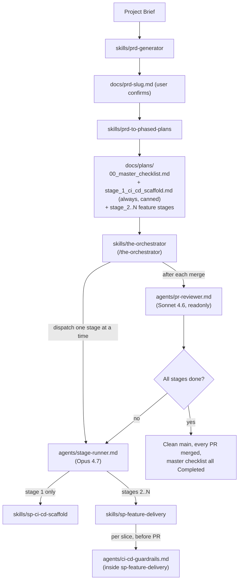

# Phased Dev Workflow

A Cursor skills plugin for PRD-driven development: generate requirements documents, decompose them into phased implementation plans, and enforce CI/CD quality gates throughout delivery.

## Installation

### Cursor (Plugin Marketplace)

```text
/add-plugin phased-dev-workflow
```

Or search for "phased-dev-workflow" in the Cursor plugin marketplace.

### Manual

Clone this repo and symlink or copy the contents into your project's `.cursor/` directory:

```bash
git clone https://github.com/steve-piece/phased-dev-workflow.git
```

## Workflow



The high-level loop:

1. **`prd-generator`** turns a brief into `docs/prd-<slug>.md`.
2. **`prd-to-phased-plans`** decomposes the PRD into `docs/plans/00_master_checklist.md` and a series of `stage_<n>_*.md` files. Stage 1 is **always** the canned `stage_1_ci_cd_scaffold.md` that delegates to `sp-ci-cd-scaffold`. Stages 2..N are written by parallel `phased-plan-writer` subagents.
3. **`/the-orchestrator`** drives the entire plan end-to-end. For each stage, sequentially:
   - Dispatches an Opus 4.7 `stage-runner` subagent that loads `sp-ci-cd-scaffold` (stage 1) or `sp-feature-delivery` (stages 2..N) and ships the slice.
   - Inside `sp-feature-delivery`, the per-slice `ci-cd-guardrails` subagent runs before PR creation to keep CI infra intact and propose additive E2E coverage.
   - After merge, the orchestrator dispatches a Sonnet 4.6 `pr-reviewer` subagent and walks an orchestrator loop checklist before advancing.
   - Clean-`main` invariant is enforced between every stage.

## Skills

### prd-generator

Generate a complete PRD from a free-form project brief. Accepts optional overrides to the default tech stack and conventions. Outputs a single markdown file with all 7 sections (0-6) including a phased implementation plan and Linear mapping.

**Triggers:** "create a PRD", "write a PRD", "generate a PRD", "document requirements"

**Bundled references:**
- `references/prd-template-v1.md` &mdash; canonical section structure
- `references/project-defaults.md` &mdash; default tech stack, services, conventions

### prd-to-phased-plans

Decompose a PRD into a master checklist and per-stage implementation files. Groups features into dependency-ordered stages, marks each as MVP or Phase 2, and generates `docs/plans/` with actionable task breakdowns. **Always emits a canned `stage_1_ci_cd_scaffold.md` that delegates to `sp-ci-cd-scaffold`**; Stages 2..N are written in parallel by the `phased-plan-writer` subagent.

**Triggers:** "break this into phases", "create a development plan", "staged plan", "phased approach"

**Bundled references:**
- `references/templates.md` &mdash; master checklist, stage plan, and Stage 1 (canned) templates

**Dispatched subagents:**
- [`phased-plan-writer`](skills/prd-to-phased-plans/agents/phased-plan-writer.md) &mdash; one invocation per stage 2..N, in parallel; never dispatched for stage 1 (canned)

### sp-ci-cd-scaffold

Bootstrap a production-grade CI/CD + E2E baseline on a dedicated `chore/ci-cd-scaffold` branch. Always runs as Stage 1 of any phased plan. Creates Playwright `@feature` / `@regression-core` suites, GitHub Actions `ci.yml` / `e2e.yml` / `e2e-coverage.yml`, Husky `pre-push`, a PR template, and the branch-protection setup script. Ends with a green PR merged to `main` and a fully checked completion checklist.

**Triggers:** "scaffold ci/cd", "set up CI", "bootstrap quality gates", `/sp-ci-cd-scaffold`, Stage 1 of any phased plan

**Bundled references:**
- `references/scaffold-completion-checklist.md` &mdash; mandatory end-of-scaffold checklist
- `references/scaffold-artifact-templates.md` &mdash; verbatim file templates for every artifact

### sp-feature-delivery

Orchestrate phased feature delivery from `docs/plans/` using a parallel-subagent pipeline (discovery, checklist curator, skill/MCP scout, implementer, spec reviewer, quality reviewer, ci-cd-guardrails) with branching, CI/E2E gates, and live master-checklist updates. Runs on Opus 4.7 as the orchestrator; subagents are capped at Sonnet 4.6.

**Triggers:** "deliver the next stage", "ship stage N", "execute docs/plans", "work the checklist", `/sp-feature-delivery`

**Bundled references:**
- `references/completion-checklist.md` &mdash; mandatory end-of-slice checklist

**Dispatched subagents** (all in `skills/sp-feature-delivery/agents/`):
- `discovery` &mdash; Phase 1 codebase + GitNexus reconnaissance
- `checklist-curator` &mdash; Phase 1 slice scoping + checklist diff
- `skill-mcp-scout` &mdash; Phase 1 skill / MCP / rule discovery
- `implementer` &mdash; Phase 4 slice implementation
- `spec-reviewer` &mdash; Phase 4 spec compliance
- `quality-reviewer` &mdash; Phase 4 code quality
- `ci-cd-guardrails` &mdash; Phase 5 per-feature CI/CD safety pass; blocks PR creation if existing gates would weaken

### the-orchestrator

Drive an entire phased plan end-to-end by dispatching one Opus 4.7 `stage-runner` subagent per stage in strict sequence. Reads the master checklist, runs each stage through the right skill (`sp-ci-cd-scaffold` for stage 1, `sp-feature-delivery` for stages 2..N), verifies each PR via a Sonnet 4.6 `pr-reviewer` subagent, ensures clean return to `main` between stages, then advances. Replaces the manual "open a fresh chat per stage and paste `Complete all steps in @{STAGE_FILE} /sp-feature-delivery`" workflow.

**Triggers:** "run the whole plan", "ship every stage", "automate the build", "drive the phased plan to completion", `/the-orchestrator`

**Bundled references:**
- `references/orchestrator-loop-checklist.md` &mdash; per-stage gate before advancing
- `references/per-stage-prompt-template.md` &mdash; exact prompt sent to each stage-runner

**Dispatched subagents** (in `skills/the-orchestrator/agents/`):
- `stage-runner` &mdash; **Opus 4.7 (hard-pinned)**, runs one stage end-to-end via the right skill
- `pr-reviewer` &mdash; Sonnet 4.6, readonly, post-merge sanity check

## Agents

### phased-plan-writer

Stage-plan author dispatched by the `prd-to-phased-plans` skill. Writes one `docs/plans/stage_N_<short_name>.md` per dispatch from orchestrator-supplied scope, dependencies, and project rules. Returns a structured summary (`path`, `stage`, `tasks_count`, `dependencies_used`, `unresolved`). **Out of scope: never writes `stage_1_ci_cd_scaffold.md`** — that is canned and written directly by the orchestrator skill.

### ci-cd-guardrails (inside sp-feature-delivery)

Read-only per-feature CI/CD safety pass dispatched in Phase 5 of `sp-feature-delivery`. Verifies the four scaffold artifacts are still present, proposes additive `@feature` / `@regression-core` E2E coverage for the slice, and blocks PR creation if any existing CI gate would be weakened. Returns a structured verdict (`pass | fail`).

### stage-runner (inside the-orchestrator)

**Opus 4.7** subagent dispatched one-at-a-time by `the-orchestrator`. Loads `sp-ci-cd-scaffold` (stage 1) or `sp-feature-delivery` (stages 2..N) and runs that skill end-to-end against the supplied stage file. Returns a structured summary including `pr_url`, `branch`, `tests_green`, and `completion_checklist_all_checked`. Does not advance to the next stage — the orchestrator owns sequencing.

### pr-reviewer (inside the-orchestrator)

Sonnet 4.6 read-only post-merge sanity check dispatched by `the-orchestrator` after each stage's PR merges. Confirms the diff matches the stage's scope, CI was green on the merged head SHA, and no out-of-scope files leaked in. Returns `verdict: pass | fail` plus `scope_drift` and `ci_status`.

## Commands

### /the-orchestrator

Thin shim that loads the `the-orchestrator` skill. Use when you want the entire phased plan delivered autonomously without manual per-stage prompting.

### /sp-feature-delivery

Execute one stage of phased implementation work from `docs/plans/`. Loads the `sp-feature-delivery` skill. Use when you only want to ship a single slice rather than driving the full plan.

### /sp-ci-cd-scaffold

Bootstrap CI/CD + E2E infrastructure on a dedicated `chore/ci-cd-scaffold` branch. Loads the `sp-ci-cd-scaffold` skill. Run this directly only if you are not using `/the-orchestrator` (which calls it automatically as Stage 1).

## Rules

### prd-ci-cd-checklist

Always-apply rule enforcing strict CI/CD controls during phased plan delivery: checklist updates before and after integration runs, merge gating on all test suites, artifact upload requirements, and one-slice-per-PR discipline.

## Default Tech Stack

Unless overridden, PRDs reference the phased Default Project Setup:

| Category | Default |
|---|---|
| Architecture | Turborepo monorepo |
| Frontend | Next.js App Router, React, TypeScript, Tailwind CSS, shadcn/ui |
| Backend | Supabase (PostgreSQL, Auth, Storage, Edge Functions) |
| Testing | Vitest (unit), Playwright (E2E) |
| Deployment | Vercel |
| Payments | Stripe |
| Email | Resend |
| Issue Tracking | Linear |
| Version Control | GitHub |

## License

MIT
