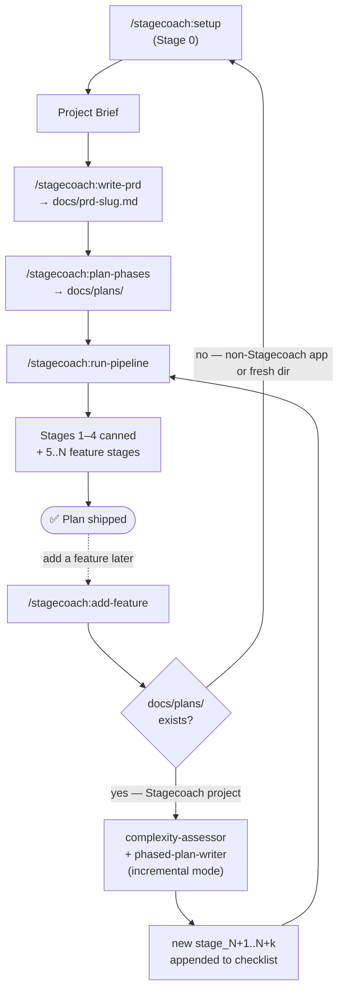

# Stagecoach

> A Claude Code plugin that takes a project from a free-form brief to a shipping production web app through a phased, multi-agent workflow.

Stagecoach scaffolds a cohesive design system, CI/CD with visual + design-system regression gates, an environment-setup gate, an optional database schema foundation, and 20–30 vertical-slice feature stages — pausing for human approval only at the four checkpoint categories where judgment actually matters.

---

## Install

```text
/add-plugin stagecoach
```

Or clone manually: `git clone https://github.com/steve-piece/stagecoach.git` and add it as a plugin via your project rules file.

---

## Quickstart

```text
/stagecoach:setup           # Stage 0 — bootstrap project + per-project config (or first-time install of system-wide defaults)
/stagecoach:write-prd       # Brief → docs/prd-<slug>.md
/stagecoach:plan-phases     # PRD → docs/plans/00_master_checklist.md + 4 canned + 20–30 feature stages
/stagecoach:run-pipeline    # Drive every stage end-to-end (default mode pauses between stages)
```

After the initial plan ships, use `/stagecoach:add-feature` to bolt on more features without rewriting the plan.

---

## Workflow



The dashed loop is the **post-launch flow**: once a plan ships, `/stagecoach:add-feature` extends the existing master checklist with new stages and feeds them back through the same `run-pipeline` delivery — so new features get the same CI gates as the original work. If you point `add-feature` at a project that wasn't built with Stagecoach, it routes you to `/stagecoach:setup` first (Step 3 of setup scaffolds the CI/CD baseline so post-PRD additions still pass the gates).

**Foundation stages** (always run, in order):

| # | Stage | Skill |
|---|---|---|
| 1 | Design system gate | `init-design-system` |
| 2 | CI/CD scaffold | `scaffold-ci-cd` |
| 3 | Environment setup gate | `setup-environment` |
| 4 | DB schema foundation (conditional) | `ship-feature` (DB context) |
| 5..N | Feature stages (vertical slices, 20–30 typical) | `ship-frontend` or `ship-feature` |

Hard caps per stage: **6 tasks**, ~10–15 files changed, completable in one fresh agent session. Override `stages.maxTasksPerStage` in `stagecoach.config.json`.

---

## Skills

| Skill | Slash command | Role |
|---|---|---|
| `setup` | `/stagecoach:setup` | Stage 0 — first-time install, new-project scaffold, OR per-project config + CI/CD baseline check (auto-detects flow) |
| `write-prd` | `/stagecoach:write-prd` | Brief → 8-section PRD; plan-mode question gate (3–7 Qs) + automatic `prd-reviewer` |
| `plan-phases` | `/stagecoach:plan-phases` | PRD → master checklist + 4 canned + 20–30 feature stages; 12-Q context elicitation |
| `init-design-system` | `/stagecoach:init-design-system` | Stage 1 design-system gate (bundle-first or brief-first) |
| `setup-environment` | `/stagecoach:setup-environment` | Stage 3 — provisioning checklist + env-verifier |
| `scaffold-ci-cd` | `/stagecoach:scaffold-ci-cd` | Stage 2 CI/CD baseline (workflows, husky, design-system-compliance, `@visual` Playwright, conditional `db-schema-drift`) |
| `ship-frontend` | `/stagecoach:ship-frontend` | `type:frontend` stages — 6-agent pipeline (UX → layout → block-composer → component-crafter → state-illustrator → visual-reviewer) |
| `ship-feature` | `/stagecoach:ship-feature` | `type:backend / full-stack / db-schema / infrastructure` stages — implementer (`opus, xhigh`) + spec/quality/CI reviewers |
| `add-feature` | `/stagecoach:add-feature` | Bolt 1+ new features onto an existing master checklist via `complexity-assessor` + incremental `phased-plan-writer` |
| `run-pipeline` | `/stagecoach:run-pipeline` | Conduct the entire plan end-to-end (default mode pauses per stage; `--auto-mvp` and `--auto-all` flags available) |
| `review-pipeline` | `/stagecoach:review-pipeline` | (Experimental) cross-stage friction detection after a full plan completes |

Each skill's full reference, sub-agents, and completion checklist live in `skills/<name>/SKILL.md`.

---

## Personalize

Drop a `stagecoach.config.json` at your project root to override defaults:

```jsonc
{
  "modelTiers":   { "implementer": "opus", "qualityReviewer": "opus" },
  "stages":       { "maxTasksPerStage": 6, "targetFeatureStages": "20-30" },
  "mcps":         { "shadcn": true, "magic": false, "figma": false, "chromeDevTools": true },
  "visualReview": { "tools": ["claude-in-chrome", "chrome-devtools-mcp", "playwright"], "vizzly": false },
  "hitl":         { "additionalCategories": [] },
  "rules":        { "imports": [] }
}
```

Full schema + precedence rules at [`skills/setup/references/stagecoach-config-schema.md`](skills/setup/references/stagecoach-config-schema.md). System-wide defaults via `~/.stagecoach/defaults.json` (created during first-time install).

**Precedence (top wins):** env vars → `stagecoach.config.json` → project rules file (CLAUDE.md / AGENTS.md) → plugin defaults.

---

## Conventions worth knowing

- **HITL bubbling.** Sub-agents never prompt the user directly — they return `needs_human: true` with one of four categories: `prd_ambiguity`, `external_credentials`, `destructive_operation`, `creative_direction`. Only `run-pipeline` calls `ask_user_input_v0`.
- **Model tiers.** Three aliases (`haiku`, `sonnet`, `opus`); heavier tiers go to producing/verifying agents (`implementer` = `opus, xhigh`; `quality-reviewer` = `opus, high`). Full per-agent table at [`skills/setup/references/model-tier-guide.md`](skills/setup/references/model-tier-guide.md).
- **Visual review tooling priority** (hardcoded, no discovery): Claude in Chrome > Chrome DevTools MCP > Playwright > Vizzly. Full-page screenshots only at 375 / 768 / 1280 / 1920 viewports.
- **One slice per PR.** Default branch naming: `feat/stage-<n>-<scope>`.

---

## Repository

- GitHub: [steve-piece/stagecoach](https://github.com/steve-piece/stagecoach)
- Changelog: [CHANGELOG.md](CHANGELOG.md)

## License

MIT
