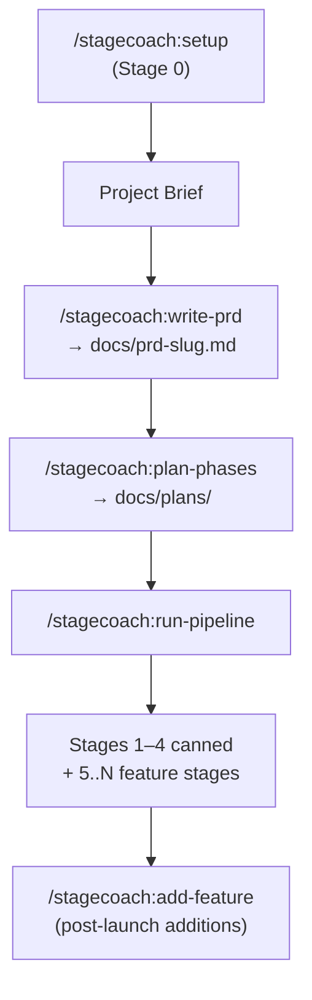

# Stagecoach

> A Claude Code plugin that takes a project from a free-form brief to a shipping production web app through a phased, multi-agent workflow.

Stagecoach scaffolds a cohesive design system, CI/CD with visual + design-system regression gates, an environment-setup gate, an optional database schema foundation, and 20–30 vertical-slice feature stages — pausing for human approval only at the four checkpoint categories where judgment actually matters.

---

## Install

```text
/add-plugin stagecoach
```

Or clone manually: `git clone https://github.com/steve-piece/phased-dev-workflow.git` and add it as a plugin via your project rules file.

---

## Quickstart

```text
/stagecoach:setup           # Stage 0 — bootstrap project + per-project config (or first-time install of system-wide defaults)
/stagecoach:write-prd       # Brief → docs/prd-<slug>.md
/stagecoach:plan-phases     # PRD → docs/plans/00_master_checklist.md + 4 canned + 20–30 feature stages
/stagecoach:run-pipeline    # Drive every stage end-to-end (default mode pauses between stages)
```

After the initial plan ships, use `/stagecoach:add-feature` to bolt on more features without rewriting the plan.

---

## Workflow



**Foundation stages** (always run, in order):

| # | Stage | Skill |
|---|---|---|
| 1 | Design system gate | `init-design-system` |
| 2 | CI/CD scaffold | `scaffold-ci-cd` |
| 3 | Environment setup gate | `setup-environment` |
| 4 | DB schema foundation (conditional) | `ship-feature` (DB context) |
| 5..N | Feature stages (vertical slices, 20–30 typical) | `ship-frontend` or `ship-feature` |

Hard caps per stage: **6 tasks**, ~10–15 files changed, completable in one fresh agent session. Override `stages.maxTasksPerStage` in `stagecoach.config.json`.

---

## Skills

| Skill | Slash command | Role |
### setup

Stage 0 — Stagecoach's entry point. Three flows in one skill:

- **Flow A (first-time install):** Creates `~/.stagecoach/defaults.json` so future projects can opt in to your defaults via a single Group 1 question.
- **Flow B (new project):** Scaffolds a fresh Next.js single-app or Turborepo monorepo via the official scaffolders, drops in `stagecoach.config.json`, and creates a gitignored `ROADMAP.local.md`.
- **Flow C (existing project):** Skips the bootstrap, drops in `stagecoach.config.json` only.

**Bundled references:**
- `references/stagecoach-config-schema.md` — full config schema + precedence rules
- `references/stagecoach.config.example.json` — copy-pasteable JSONC starter
- `references/model-tier-guide.md` — per-agent model tier defaults
- `references/bootstrap-templates-catalog.md` — which scaffolders Step 1 wraps and why

### `write-prd`

Generate a complete PRD from a free-form project brief. Plan-mode question gate (3–7 clarifying questions) before writing. Outputs a single markdown file with all eight sections (0 through 7). A `prd-reviewer` subagent runs automatically as the final step, with a 2-iteration revision loop before bubbling up via HITL.

**Bundled references:**
- `references/prd-template-v2.md` — canonical 8-section structure
- `references/project-defaults.md` — default tech stack, services, conventions, token category contract

**Dispatched subagents:**
- `prd-reviewer` — validates spec completeness against source materials

### plan-phases

Decompose a PRD into a master checklist and per-stage implementation files. Runs a 12-question Context Elicitation phase, emits four canned foundation stage files, and writes 20–30 vertical-slice feature stages via `phased-plan-writer`. The `master-checklist-synthesizer` subagent aggregates `completion_criteria` from every stage frontmatter into `00_master_checklist.md`.

**Bundled references:**
- `references/templates.md` — master checklist + stage plan templates
- `references/architecture-conventions.md` — opinion-free baseline (web standards, performance facts, structural variants, conditional security + framework facts)
- `references/stage-frontmatter-contract.md` — required YAML frontmatter shape
- `references/canned-stages/` — canned files for stages 1–4 + the auth dev-mode switcher snippet

**Dispatched subagents:**
- `design-system-stage-writer` — stage 1
- `ci-cd-scaffold-stage-writer` — stage 2
- `env-setup-stage-writer` — stage 3
- `db-schema-stage-writer` — stage 4 (conditional)
- `phased-plan-writer` — one invocation per feature stage (5..N), in parallel
- `master-checklist-synthesizer` — aggregates completion criteria

### init-design-system

Validate or generate a token-driven design system before any feature work. Bundle-first (Claude Design export) or brief-first (token-expander Opus pass) modes. Compliance pre-check blocks the orchestrator from advancing to Stage 2 until every token category is satisfied.

**Dispatched subagents:**
- `bundle-validator` — validates incoming handoff bundle structure
- `token-expander` — expands brand primitives into a full token set (opus, high)
- `compliance-pre-check` — verifies token coverage against the checklist

### setup-environment

Human-in-the-loop gate that ensures all external services are provisioned and `.env.local` is fully populated before feature stages begin. Generates a manual checklist per detected service (Supabase, Stripe, Resend, etc.) with direct links to provisioning consoles. The `env-verifier` subagent mechanically scans `.env.local` against expected keys without ever logging values.

**Bundled references:**
- `references/env-checklist-template.md`
- `references/known-services-catalog.md` — extensible service prefix catalog

**Dispatched subagents:**
- `env-verifier` — mechanical `.env.local` scan; never reads values

### scaffold-ci-cd

Bootstrap a production-grade CI/CD + E2E + design-system-compliance + visual regression baseline on a dedicated `chore/scaffold-ci-cd` branch. Creates Playwright `@feature` / `@regression-core` / `@visual` suites, GitHub Actions (including `design-system-compliance.yml` and `db-schema-drift.yml` conditional), Husky `pre-push`, PR template, and branch-protection setup script. Completion checklist embedded.

**Bundled references:**
- `references/scaffold-artifact-templates.md` — verbatim file templates for every artifact

### ship-frontend

Deliver `type: frontend` feature stages via a six-agent visual pipeline. Block-composer runs BEFORE component-crafter (composes from shadcn blocks before authoring custom). Visual-reviewer uses a hardcoded 4-tier tooling priority (Claude in Chrome > Chrome DevTools MCP > Playwright > Vizzly) with full-page-only screenshots at four viewports.

**Dispatched subagents:**
- `modern-ux-expert` — UX pattern selection + reference research
- `layout-architect` — shell-level layout decisions
- `block-composer` — shadcn block composition (HARD-FIRST rule)
- `component-crafter` — token-only component authoring (conditional)
- `state-illustrator` — loading / empty / error / success state coverage
- `visual-reviewer` — vision pass against design system + UX spec

Reuses `discovery`, `spec-reviewer`, `quality-reviewer`, `ci-cd-guardrails` from `ship-feature`.

### ship-feature

Orchestrate `type: backend | full-stack | infrastructure | db-schema` feature stages via a parallel-subagent pipeline. Implementer runs at `opus, xhigh`; quality-reviewer at `opus, high`; CI guardrails at `sonnet, medium` (per the [model tier preference](skills/setup/references/model-tier-guide.md)). For DB-touching stages, the implementer MUST update `db/schema.sql` (or equivalent declarative source) BEFORE writing migration or query code; the quality-reviewer verifies this.

**Dispatched subagents:**
- `discovery` — codebase + GitNexus reconnaissance (haiku)
- `checklist-curator` — slice scoping + checklist diff (sonnet)
- `implementer` — slice implementation (opus, xhigh)
- `spec-reviewer` — spec compliance check (sonnet)
- `quality-reviewer` — code quality + DB schema verification (opus, high)
- `ci-cd-guardrails` — CI/CD safety pass (sonnet, medium)

### add-feature

Bolt new features onto an existing project mid-flight. Auto-detects whether the project was built with Stagecoach (`docs/plans/00_master_checklist.md` present) or not. For Stagecoach projects: runs the `complexity-assessor` subagent to judge single-stage vs multi-stage per feature, surfaces the proposed breakdown for user authorization, then dispatches `phased-plan-writer` in incremental mode to write the new stage files (continuing the existing stage numbering) and updates the master checklist. Hands off to `/stagecoach:ship-feature` (single stage) or `/stagecoach:run-pipeline` (multiple stages) for delivery — both exercise the full CI gate. For non-Stagecoach apps, redirects to `/stagecoach:setup` (which now includes a Step 3 CI/CD baseline check for apps not going through the full PRD-to-phased-dev workflow).

**Dispatched subagents:**
- `complexity-assessor` — sonnet, medium; judges single-stage vs multi-stage and proposes the per-feature stage breakdown (read-only)
- `phased-plan-writer` (incremental mode, borrowed from `plan-phases`) — sonnet, medium; writes one stage file per invocation

### run-pipeline

Drive an entire phased plan end-to-end as a conductor (NOT autopilot). Reads the master checklist, dispatches the correct skill per stage `type`, verifies each PR via a `pr-reviewer` subagent, enforces the clean-`main` invariant between stages. The orchestrator is the **only** surface that prompts the human — all subagents bubble HITL triggers up via the structured return contract.

See [Orchestrator Modes](#orchestrator-modes) below.

**Bundled references:**
- `references/per-stage-prompt-template.md`

**Dispatched subagents:**
- `stage-runner` — opus, high; runs one stage end-to-end via the correct skill
- `pr-reviewer` — sonnet; readonly post-merge sanity check (verifies design-system-compliance, visual diffs, db/schema.sql update, env-setup gate completion)

### review-pipeline (experimental)

Cross-stage friction detection after a full plan completes. Reads the master checklist, all stage files, recent commits, and HITL escalations to surface patterns: repeated HITL triggers, recurring CI failures, scope drift. Drafts improvement PRs back to the plugin repo. Invoked manually after all stages — never called by the orchestrator. Self-modification guard prevents the skill from drafting changes to itself (avoids recursion).

**Dispatched subagents:**
- `retrospective-reviewer` — opus, high; cross-stage pattern detection

## Slash Commands

| Command (published form) | Skill loaded | When to use |
|---|---|---|
| `setup` | `/stagecoach:setup` | Stage 0 — first-time install, new-project scaffold, OR per-project config + CI/CD baseline check (auto-detects flow) |
| `write-prd` | `/stagecoach:write-prd` | Brief → 8-section PRD; plan-mode question gate (3–7 Qs) + automatic `prd-reviewer` |
| `plan-phases` | `/stagecoach:plan-phases` | PRD → master checklist + 4 canned + 20–30 feature stages; 12-Q context elicitation |
| `init-design-system` | `/stagecoach:init-design-system` | Stage 1 design-system gate (bundle-first or brief-first) |
| `setup-environment` | `/stagecoach:setup-environment` | Stage 3 — provisioning checklist + env-verifier |
| `scaffold-ci-cd` | `/stagecoach:scaffold-ci-cd` | Stage 2 CI/CD baseline (workflows, husky, design-system-compliance, `@visual` Playwright, conditional `db-schema-drift`) |
| `ship-frontend` | `/stagecoach:ship-frontend` | `type:frontend` stages — 6-agent pipeline (UX → layout → block-composer → component-crafter → state-illustrator → visual-reviewer) |
| `ship-feature` | `/stagecoach:ship-feature` | `type:backend / full-stack / db-schema / infrastructure` stages — implementer (`opus, xhigh`) + spec/quality/CI reviewers |
| `add-feature` | `/stagecoach:add-feature` | Bolt 1+ new features onto an existing master checklist via `complexity-assessor` + incremental `phased-plan-writer` |
| `run-pipeline` | `/stagecoach:run-pipeline` | Conduct the entire plan end-to-end (default mode pauses per stage; `--auto-mvp` and `--auto-all` flags available) |
| `review-pipeline` | `/stagecoach:review-pipeline` | (Experimental) cross-stage friction detection after a full plan completes |

Each skill's full reference, sub-agents, and completion checklist live in `skills/<name>/SKILL.md`.

---

## Personalize

Drop a `stagecoach.config.json` at your project root to override defaults:

```jsonc
{
  "modelTiers":   { "implementer": "opus", "qualityReviewer": "opus" },
  "stages":       { "maxTasksPerStage": 6, "targetFeatureStages": "20-30" },
  "mcps":         { "shadcn": true, "magic": false, "figma": false, "chromeDevTools": true },
  "visualReview": { "tools": ["claude-in-chrome", "chrome-devtools-mcp", "playwright"], "vizzly": false },
  "hitl":         { "additionalCategories": [] },
  "rules":        { "imports": [] }
}
```

Full schema + precedence rules at [`skills/setup/references/stagecoach-config-schema.md`](skills/setup/references/stagecoach-config-schema.md). System-wide defaults via `~/.stagecoach/defaults.json` (created during first-time install).

**Precedence (top wins):** env vars → `stagecoach.config.json` → project rules file (CLAUDE.md / AGENTS.md) → plugin defaults.

---

## Conventions worth knowing

- **HITL bubbling.** Sub-agents never prompt the user directly — they return `needs_human: true` with one of four categories: `prd_ambiguity`, `external_credentials`, `destructive_operation`, `creative_direction`. Only `run-pipeline` calls `ask_user_input_v0`.
- **Model tiers.** Three aliases (`haiku`, `sonnet`, `opus`); heavier tiers go to producing/verifying agents (`implementer` = `opus, xhigh`; `quality-reviewer` = `opus, high`). Full per-agent table at [`skills/setup/references/model-tier-guide.md`](skills/setup/references/model-tier-guide.md).
- **Visual review tooling priority** (hardcoded, no discovery): Claude in Chrome > Chrome DevTools MCP > Playwright > Vizzly. Full-page screenshots only at 375 / 768 / 1280 / 1920 viewports.
- **One slice per PR.** Default branch naming: `feat/stage-<n>-<scope>`.

---

## Repository

- GitHub: [steve-piece/phased-dev-workflow](https://github.com/steve-piece/phased-dev-workflow) (will be renamed to `stagecoach`)
- Changelog: [CHANGELOG.md](CHANGELOG.md)

## License

MIT
