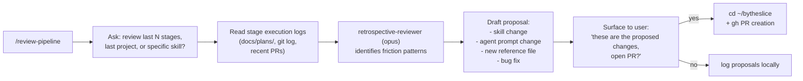

<!-- skills/close-shop/SKILL.md -->
<!-- EXPERIMENTAL. Pizza-shop framing: bookends /setup-shop — once the day's service is done, sit down and debrief the shift. Reviews how recent stages and skills executed, identifies systemic friction patterns, and drafts targeted improvement PRs against the plugin repository. -->

# Close the Shop — After-Service Retro

> **EXPERIMENTAL.** This skill is under active development. All PRs it generates open as drafts and require human review before merge. The skill never auto-merges and never modifies itself.

ByTheSlice skill that reviews how recent stages and skills executed, identifies systemic friction patterns, and drafts targeted improvement PRs against the plugin repository. Use this after completing a project or a significant batch of stages to close the feedback loop on the workflow itself.

---

## A. Purpose

- Analyze execution logs, git history, PR records, and HITL escalation data to detect patterns where the plugin is causing repeated friction
- Propose concrete changes (skill prompts, agent prompts, reference files, bug fixes, or new files)
- Draft one or more PRs to the plugin repo for human review and merge

This skill does not modify production code in your project. It only targets the plugin repo at `~/bytheslice` (or `BYTHESLICE_PLUGIN_PATH` if set).

---

## B. Pre-requisites

Before invoking this skill, verify:

1. **Plugin path** — The plugin must exist at one of:
   - `~/bytheslice` (expands to `/Users/<username>/bytheslice` on macOS)
   - Absolute path set in the `BYTHESLICE_PLUGIN_PATH` environment variable (checked first if set)
   - The skill expands `~` on macOS using the shell; if `BYTHESLICE_PLUGIN_PATH` is set in the environment, that value takes precedence

2. **`gh` CLI** — Must be installed and authenticated against the plugin repo (`steve-piece/bytheslice`). Run `gh auth status` to verify before proceeding.

3. **Invocation** — User invokes via `/review-pipeline`. Natural-language triggers: "review the workflow", "improve the plugin".

---

## C. Flow



### Step 1 — Determine scope

Ask the user (via `ask_user_input_v0`) which scope to review.

**Always provide a recommended answer in available options.**


> "Which scope should I review for this retrospective?"
> single_select:
> - "Last N stages of the current project" — prompts for N
> - "Last completed project (all stages)"
> - "Specific skill or agent" — prompts for skill name

### Step 2 — Read execution data

Collect the following for the chosen scope:

| Source | What to read |
| --- | --- |
| `docs/plans/` in the project | Stage files, master checklist, completion criteria |
| `git log` (project repo) | Commit history, timestamps, author attribution |
| Recent PRs (project repo) | PR titles, descriptions, review comments via `gh pr list` |
| HITL escalation log | Any `needs_human: true` returns captured in stage output |

Pass all collected data to `agents/review-pipeline-reviewer.md`.

### Step 3 — Analyze and draft proposals

Dispatch `agents/review-pipeline-reviewer.md` (opus, high effort). The agent reads the collected data, identifies friction patterns, and returns structured proposals including unified diffs for each proposed change.

### Step 4 — Surface proposals to user

Present the `patterns_observed` and `proposed_changes` returned by `retrospective-reviewer` in a readable summary. Ask the user (via `ask_user_input_v0`):

> "Here are the proposed plugin improvements. Would you like to open a draft PR?"
> single_select: ["Yes — open a draft PR", "No — save proposals locally and exit"]

If the user chooses **No**: write the proposals to `docs/review-pipeline-<yyyy-mm-dd>.md` in the current project directory and exit.

### Step 5 — Create PR (if confirmed)

Resolve the plugin path:

```bash
PLUGIN_PATH="${BYTHESLICE_PLUGIN_PATH:-$HOME/bytheslice}"
cd "$PLUGIN_PATH"
```

Create a branch and open a draft PR:

```bash
BRANCH="retrospective/<yyyy-mm-dd>-<topic>"
git checkout -b "$BRANCH"
# Apply each diff from proposed_changes
gh pr create \
  --draft \
  --title "[retrospective] <topic>" \
  --body "<PR body — see E below>" \
  --label "retrospective" \
  --label "experimental"
```

Return the PR URL to the user.

---

## D. retrospective-reviewer Agent

The analysis step is delegated entirely to `agents/review-pipeline-reviewer.md`.

- Model: `opus`, effort: high — cross-stage pattern detection benefits from depth
- Tools: `Read`, `Glob`, `Grep`, `Bash` (read-only invocations only)
- The agent never writes files to disk; it returns structured YAML

Friction signals the agent looks for:

- Stages that required more than 2 implementer passes
- Stages where visual-reviewer rejected output more than 1 time
- HITL escalations clustered in one category (suggests a systematic gap in the skill)
- Token budget overruns
- User corrections to agent output (commits authored by the user shortly after agent-authored commits, detected via `git log --author` comparison)

---

## E. PR Creation Rules

Every PR opened by this skill follows these conventions:

| Field | Value |
| --- | --- |
| Branch name | `retrospective/<yyyy-mm-dd>-<topic>` |
| PR title | `[retrospective] <topic>` |
| PR state | Draft — never ready-for-review on open |
| Labels | `retrospective`, `experimental` |

**PR body must include:**
1. **Patterns observed** — bullet list from `retrospective-reviewer` output
2. **Proposed changes summary** — one sentence per change with the target file
3. **Project link** — name and/or repo URL of the project that triggered this retrospective
4. **Diff(s)** — inline unified diffs for each proposed change, or a reference to the branch commits

---

## F. Limits

The following limits are hard constraints — not suggestions:

1. **Max 1 retrospective PR per week per project.** Before opening a PR, check `gh pr list --repo steve-piece/bytheslice --label retrospective --state open` to verify no retrospective PR is already open for this project within the past 7 days. If one exists, append the new proposals to the existing PR instead of opening a duplicate.

2. **Never auto-merge.** All PRs open as drafts. The skill does not call `gh pr merge` under any circumstances.

3. **Never modifies the retrospective skill itself.** If `retrospective-reviewer` proposes a change to any file under `skills/review-pipeline/` or `commands/review-pipeline.md`, the skill must skip that proposal, log a warning in the PR body ("Skipped: self-modification guard"), and continue with other proposals. This prevents infinite recursion.

---

## G. Return Contract

After all work is complete (PR opened or proposals saved locally), return:

```yaml
status: complete | failed | needs_human
summary: <one paragraph — scope reviewed, patterns found, proposals made, PR URL if opened>
artifacts:
  - <PR URL if opened, or path to local proposals file>
needs_human: false | true
hitl_category: null | "prd_ambiguity" | "external_credentials" | "destructive_operation" | "creative_direction"
hitl_question: null | "<plain-language question if blocked>"
hitl_context: null | "<what triggered this>"
```

**HITL triggers for this skill:**
- Plugin path does not exist and `BYTHESLICE_PLUGIN_PATH` is not set → `needs_human: true`, `hitl_category: prd_ambiguity`, `hitl_question: "The plugin path ~/bytheslice does not exist and BYTHESLICE_PLUGIN_PATH is not set. What is the correct path to the plugin repo?"`
- `gh` CLI is not authenticated → `needs_human: true`, `hitl_category: external_credentials`, `hitl_question: "gh CLI is not authenticated. Please run 'gh auth login' and then re-invoke the skill."`
- PR creation fails (e.g., label does not exist, branch push rejected) → `needs_human: true`, `hitl_category: destructive_operation`

This skill does NOT call `ask_user_input_v0` for HITL resolution — it bubbles the structured contract up.

---

## Completion Checklist

[ ] Scope determined (last N stages, last project, or specific skill)
[ ] Plugin path resolved (`BYTHESLICE_PLUGIN_PATH` checked first, then `~/bytheslice`)
[ ] `gh` CLI authentication verified before attempting any PR creation
[ ] Execution data gathered: stage files, git log, recent PRs, HITL escalation records
[ ] `retrospective-reviewer` (opus) dispatched with all gathered data
[ ] `patterns_observed` and `proposed_changes` received from `retrospective-reviewer`
[ ] Self-modification guard applied — no proposals targeting `skills/review-pipeline/` or `commands/review-pipeline.md`
[ ] Proposals surfaced to user with clear summary
[ ] User confirmed PR or elected to save locally
[ ] If PR: branch name follows `retrospective/<yyyy-mm-dd>-<topic>` format
[ ] If PR: opened as draft (never ready-for-review)
[ ] If PR: labeled `retrospective` and `experimental`
[ ] If PR: body includes patterns observed, proposed changes summary, and project link
[ ] Duplicate PR guard checked (max 1 open retrospective PR per project per week)
[ ] If save locally: proposals written to `docs/review-pipeline-<yyyy-mm-dd>.md`
[ ] Return contract YAML emitted
[ ] No `- [ ]` checkbox syntax used in any output — only `[ ]`
[ ] No platform-specific bare references ("cursor rules", "claude rules") in any output
